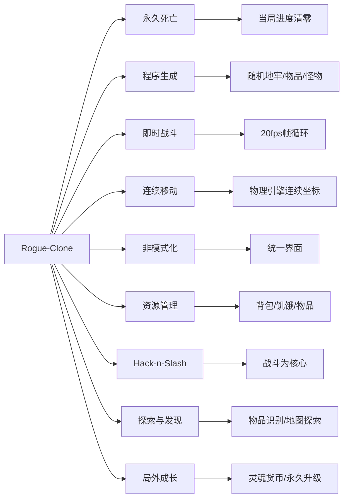
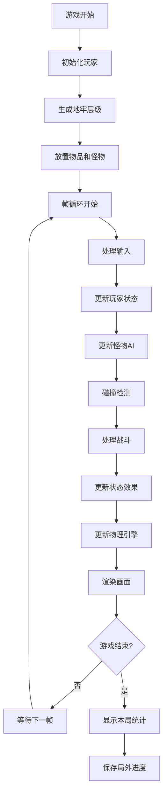
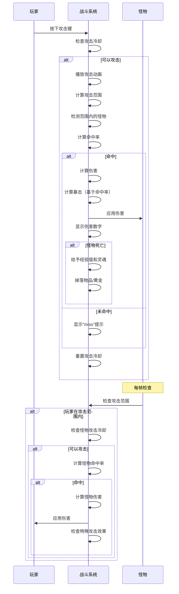
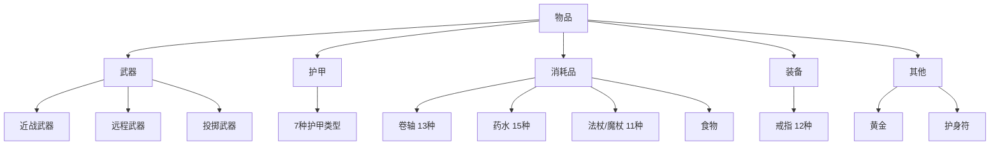
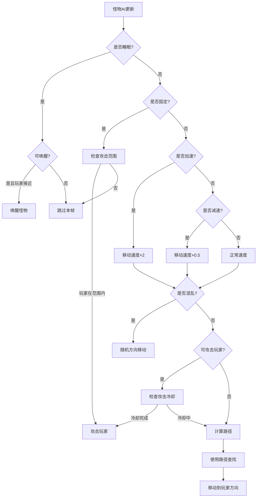
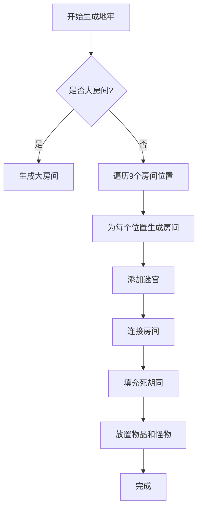
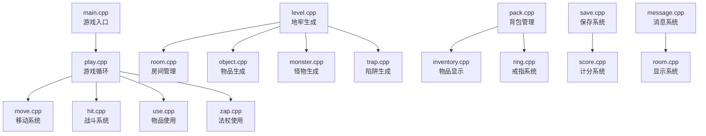
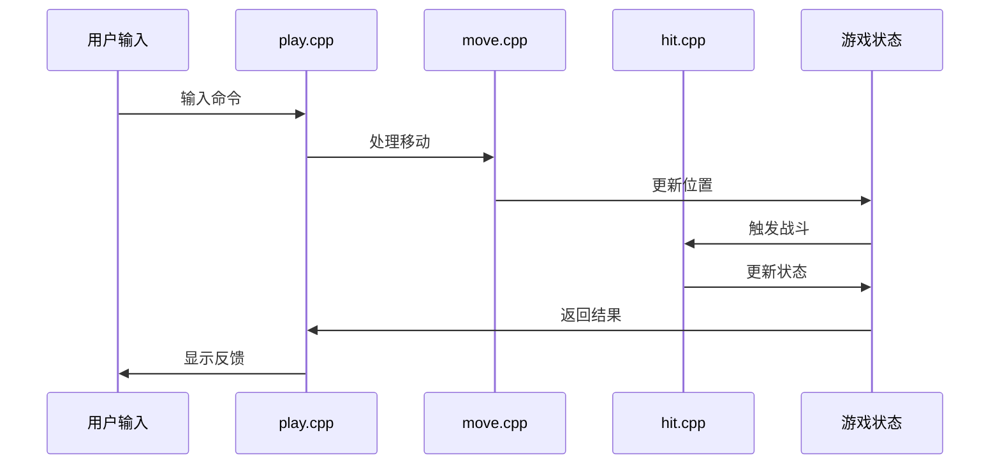

# Rogue-Clone 项目功能文档

> 本文档用于描述 rogue-clone 项目的所有功能模块和游戏机制，以便在其他语言或框架中复现该项目。

## 目录

1. [项目概述](#1-项目概述)
   - [Roguelite 游戏定义](#13-roguelite-游戏定义)
2. [核心游戏系统](#2-核心游戏系统)
3. [战斗系统](#3-战斗系统)
4. [物品系统](#4-物品系统)
5. [怪物系统](#5-怪物系统)
6. [陷阱系统](#6-陷阱系统)
7. [游戏机制](#7-游戏机制)
8. [物理系统](#8-物理系统)
9. [地牢生成系统](#9-地牢生成系统)
10. [保存/加载系统](#10-保存加载系统)
11. [局外成长系统](#11-局外成长系统meta-progression)
12. [计分系统](#12-计分系统)
13. [用户界面系统](#13-用户界面系统)
14. [渲染系统](#14-渲染系统)
15. [配置系统](#15-配置系统)
16. [系统架构总结](#16-系统架构总结)
17. [复现指南](#17-复现指南)

---

## 1. 项目概述

### 1.1 项目简介

Rogue-Clone 是一个 Roguelite 地牢探索游戏，基于 4.3BSD-Tahoe 版本的 rogue 游戏。这是一个即时战斗、基于图形界面的地牢探索游戏，玩家需要深入地下城，收集宝藏，击败怪物，最终找到并带回 Yendor 护身符。游戏采用局外成长系统，允许玩家在死亡后通过永久升级来增强后续游戏体验。

### 1.2 游戏类型

- **类型**: Roguelite（类 Rogue 游戏变体）
- **视角**: 俯视视角，图形界面
- **玩法**: 即时战斗地牢探索（20fps）
- **目标**: 深入地牢，找到 Yendor 护身符并返回地面
- **特色**: 局外永久成长系统，死亡后保留部分进度

### 1.3 Roguelite 游戏定义

Rogue-Clone 是一个**Roguelite** 游戏，在保留 Roguelike 核心机制的同时，引入了现代游戏设计元素。Roguelite 是 Roguelike 的变体，在保持程序生成和永久死亡的同时，移除了回合制和网格化限制，并添加了局外成长系统。

#### 1.3.1 保留的 Roguelike 特征

| 特征 | 说明 | Rogue-Clone 实现 |
|------|------|-----------------|
| **永久死亡（Permadeath）** | 角色一旦死亡，当局进度清零 | ✅ 死亡后当局进度清零，但局外进度保留 |
| **程序生成（Procedural Generation）** | 地图、道具、怪物等核心内容随机生成 | ✅ 地牢、物品、怪物位置完全随机生成 |
| **非模式化（Non-modal）** | 所有行为在同一界面完成 | ✅ 战斗、探索、物品使用都在同一界面完成 |
| **资源管理（Resource Management）** | 有限的生命、道具、食物等迫使策略取舍 | ✅ 背包限制、饥饿系统、物品耐久度等 |
| **Hack-n-Slash** | 以战斗为核心玩法，击败敌人获取资源 | ✅ 战斗是核心玩法，击败怪物获得经验和物品 |
| **探索与发现（Exploration & Discovery）** | 必须亲自识别道具效果、地图布局 | ✅ 物品需要识别，地图需要探索才能显示 |

#### 1.3.2 移除的 Roguelike 特征

| 特征 | 原 Roguelike 实现 | Rogue-Clone 新实现 |
|------|-----------------|------------------|
| **回合制（Turn-based）** | 玩家与敌人轮流行动 | ❌ 改为即时战斗（20fps帧循环） |
| **网格化（Grid-based）** | 24×80 网格地图，所有移动基于格子 | ❌ 改为连续坐标系统，使用物理引擎 |
| **ASCII 界面** | 文本字符界面 | ❌ 改为图形界面（Web技术） |

#### 1.3.3 新增的 Roguelite 特征

| 特征 | 说明 | Rogue-Clone 实现 |
|------|------|-----------------|
| **局外永久升级** | 死亡后保留部分进度，用于永久升级 | ✅ 灵魂货币系统，永久升级和解锁 |
| **即时战斗** | 实时战斗，基于帧循环 | ✅ 20fps帧循环，基于动画时长的攻击 |
| **连续移动** | 平滑的连续移动系统 | ✅ 物理引擎驱动的连续移动 |
| **图形界面** | 现代图形界面 | ✅ Web图形界面（HTML5 Canvas/WebGL） |

#### 1.3.4 Rogue-Clone 的 Roguelite 特征



#### 1.3.5 Roguelike vs Roguelite

**纯 Roguelike（如 Nethack、ADOM）**：
- ✅ 严格遵循柏林准则的所有 8 个核心要素
- ✅ 使用 ASCII 字符界面
- ✅ 回合制、网格化
- ✅ 无局外永久升级
- ✅ 每次游戏完全独立

**Roguelite（如 Hades、Dead Cells、Rogue Legacy）**：
- ✅ 保留：程序生成、永久死亡（当局）
- ❌ 移除：回合制、网格化、ASCII 界面
- ➕ 新增：局外永久升级、即时战斗、连续移动

**Rogue-Clone 的定位**：
- 属于**Roguelite** 游戏
- 是经典 Rogue 游戏的现代 Roguelite 实现
- 适合想要体验 Roguelite 游戏机制的玩家
- 适合学习和研究 Roguelite 游戏设计的开发者

### 1.4 技术栈

- **语言**: JavaScript/TypeScript
- **渲染引擎**: HTML5 Canvas 或 WebGL
- **游戏框架**: Phaser.js / Pixi.js（可选）
- **物理引擎**: Matter.js（轻量级物理引擎）
- **状态管理**: Redux 或 Zustand（局外数据管理）
- **数据持久化**: LocalStorage API
- **平台**: Web浏览器（跨平台：Windows/macOS/Linux/移动端）
- **构建工具**: Webpack / Vite / Parcel

### 1.5 核心特性

- 程序化生成的地牢（每次游戏都不同）
- 26 种不同的怪物（A-Z）
- 丰富的物品系统（武器、护甲、卷轴、药水、法杖、戒指等）
- 即时战斗系统（20fps帧循环）
- 局外永久成长系统（灵魂货币、升级、解锁）
- 物品识别和附魔系统
- 陷阱系统
- 饥饿和生存机制
- 经验值和等级系统

---

## 2. 核心游戏系统

### 2.1 游戏循环

游戏采用基于帧循环的即时战斗结构，固定运行在 20fps（每帧 50ms）：



**主要流程**：
1. **初始化阶段**：创建玩家角色，设置初始属性（应用局外升级）
2. **地牢生成**：为每个层级生成房间、通道、楼梯
3. **物品放置**：在地牢中随机放置物品
4. **怪物生成**：根据层级难度生成怪物
5. **帧循环**（每帧执行，20fps）：
   - 处理玩家输入（键盘、鼠标）
   - 更新玩家状态（移动、攻击、使用物品）
   - 更新所有怪物 AI 和移动
   - 执行碰撞检测和响应
   - 处理战斗逻辑
   - 更新状态效果持续时间
   - 更新物理引擎
   - 渲染游戏画面
   - 检查游戏结束条件

### 2.2 帧循环机制

游戏采用固定帧率的帧循环系统：

- **帧率**：固定 20fps（每帧 50ms）
- **时间步长**：基于 deltaTime（实际经过的时间）而非固定回合数
- **每帧更新**：
  - 玩家移动和攻击
  - 所有怪物 AI 和移动
  - 战斗系统（命中判定、伤害计算）
  - 状态效果（持续时间递减）
  - 物理引擎（碰撞检测、触发器）
   - 渲染系统（图像、动画、UI）

**时间管理**：
- 使用 `requestAnimationFrame` 或 `setInterval` 控制帧率
- 计算 deltaTime（实际经过的时间）
- 所有时间相关的计算基于 deltaTime，确保不同设备上的一致性
- 状态效果的持续时间以秒为单位，每帧递减 deltaTime

### 2.3 角色系统

#### 初始属性

玩家角色（fighter）的初始属性：

| 属性 | 初始值 | 说明 |
|------|--------|------|
| HP (生命值) | 12/12 | 当前值/最大值 |
| 力量 (Strength) | 16/16 | 影响伤害输出 |
| 敏捷 (Agility) | 12/12 | 影响攻击速度和移动速度 |
| 经验等级 | 1 | 从 1 级开始 |
| 经验点数 | 0 | 通过击败怪物获得 |
| 护甲等级 | 4 | 初始装备锁子甲 |
| 黄金 | 0 | 初始无黄金 |
| 移动步数 | 1250 | 初始饥饿值 |

#### 初始装备

- **武器**: 钉头锤 (Mace, 伤害 2d3, +1 附魔)
- **护甲**: 锁子甲 (Ringmail, 护甲等级 3+1=4)
- **远程武器**: 短弓 (Bow, 伤害 1d2, +1 命中)
- **箭矢**: 25-35 支箭 (伤害 1d2)
- **食物**: 1 份口粮

#### 属性增长机制

- **经验值系统**：击败怪物获得经验，达到阈值后升级
- **生命值增长**：升级时增加最大 HP
- **力量增长**：通过药水或戒指增加
- **敏捷增长**：通过药水、戒指或永久升级增加
- **护甲等级**：通过更好的护甲或附魔提升

---

## 3. 战斗系统

战斗系统是游戏的核心机制之一，采用即时战斗方式，基于动画时长的攻击冷却系统。

### 3.1 战斗触发

战斗在以下情况下触发：
- **玩家主动攻击**：按下攻击键（鼠标左键或空格键），向鼠标方向或移动方向攻击
- **怪物攻击**：怪物进入攻击范围时自动攻击（基于攻击冷却时间）
- **连续攻击**：按住攻击键可以连续攻击（受攻击冷却限制）

### 3.2 攻击机制

#### 3.2.1 攻击冷却系统

攻击基于动画时长和武器类型，使用冷却时间系统：

- **基础攻击冷却时间**：基于武器类型和动画时长
  - 快速武器（匕首）：0.3-0.5秒
  - 中等武器（剑）：0.5-0.8秒
  - 慢速武器（双手剑）：0.8-1.2秒
- **敏捷影响**：敏捷影响实际攻击冷却时间
  - 计算公式：`攻击冷却时间 = 基础冷却时间 / (1 + 敏捷/50)`
  - 敏捷越高，攻击速度越快（冷却时间越短）
- **攻击动画**：播放攻击动画，动画完成后才能再次攻击
- **连续攻击**：按住攻击键时，冷却时间结束后自动攻击

#### 3.2.2 攻击范围判定

- **近战攻击**：扇形或圆形范围判定
  - 攻击角度：根据武器类型（如90度扇形）
  - 攻击距离：根据武器长度（如1-2个角色宽度）
- **远程攻击**：直线或抛物线判定
  - 箭矢：直线飞行，碰撞检测
  - 投掷物：抛物线轨迹

#### 3.2.3 命中率计算

玩家攻击怪物的命中率计算公式（保留原逻辑，实时计算）：

```
命中率 = 40 + (3 × 武器命中值) + (2 × 经验等级 + 2 × 戒指经验 - 右手戒指惩罚)
```

其中：
- **武器命中值** = 武器基础命中值 + 武器附魔值
- **戒指经验**：来自戒指的额外经验加成
- **右手戒指惩罚**：某些戒指会降低命中率

怪物攻击玩家的命中率计算公式：

```
命中率 = 怪物基础命中率 - ((2 × 玩家经验等级 + 2 × 戒指经验) - 右手戒指惩罚)
```

在深层地牢（≥52层）中，怪物命中率固定为 100%。

### 3.3 伤害计算

#### 3.3.1 玩家伤害

玩家造成的伤害计算公式（保留原逻辑）：

```
总伤害 = 武器基础伤害 + 力量加成 + 经验加成 + 永久升级加成
```

**力量加成表**（保留）：

| 力量值 | 伤害加成 |
|--------|----------|
| ≤ 6    | 力量 - 5 |
| 7-14   | 1        |
| 15-17  | 3        |
| 18     | 4        |
| 19-20  | 5        |
| 21     | 6        |
| 22-30  | 7        |
| > 30   | 8        |

**经验加成**：
```
经验加成 = ((经验等级 + 戒指经验 - 右手戒指惩罚) + 1) / 2
```

**永久升级加成**（新增）：
```
永久升级加成 = 基础伤害升级等级
```

**暴击系统**（新增）：
- 暴击概率 = 基础暴击率 + 永久升级暴击率
- 暴击伤害 = 基础伤害 × 1.5（可升级提升）

#### 3.3.2 伤害数字显示

- **伤害数字**：在受击位置显示伤害数字
- **颜色区分**：
  - 普通伤害：白色
  - 暴击伤害：黄色/橙色（更大字体）
  - 未命中：灰色"MISS"
- **动画效果**：伤害数字向上飘动并淡出

#### 怪物伤害

怪物造成的伤害计算：

1. **普通怪物**：
   ```
   基础伤害 = 随机骰子伤害（如 "2d5" 表示 2个5面骰）
   实际伤害 = 基础伤害 - (护甲等级 × 3% × 基础伤害)
   ```

2. **固定伤害怪物**（如陷阱植物）：
   ```
   伤害 = 固定值（每次攻击递增）
   ```

**护甲减伤公式**：
```104:112:hit.cpp
		damage = get_damage(monster->m_damage, 1);
		float minus;
		if (cur_level >= (AMULET_LEVEL * 2))
			minus = (float)((AMULET_LEVEL * 2) - cur_level);
		else {
			minus = (float)get_armor_class(rogue.armor) * 3.00;
			minus = minus / 100.00 * (float)damage;
		}
		damage -= (short)minus;
```

### 3.4 伤害骰子系统

游戏使用标准的 D&D 风格骰子表示法：
- **格式**：`NdM` 或 `NdM/NdM`
- **示例**：
  - `2d3` = 投掷 2 个 3 面骰，结果范围 2-6
  - `3d3/2d5` = 投掷 3 个 3 面骰和 2 个 5 面骰，结果范围 5-19

### 3.5 特殊攻击效果

#### 怪物特殊攻击

某些怪物具有特殊攻击能力，在命中后触发：

| 特殊能力 | 效果 | 触发条件 |
|----------|------|----------|
| **RUSTS** (锈蚀) | 降低玩家护甲等级 | 每次命中 |
| **HOLDS** (束缚) | 玩家无法移动 | 命中且玩家未漂浮 |
| **FREEZES** (冰冻) | 玩家减速 | 每次命中 |
| **STINGS** (毒刺) | 造成额外伤害 | 每次命中 |
| **DRAINS_LIFE** (吸取生命) | 降低玩家最大 HP | 每次命中 |
| **DROPS_LEVEL** (降低等级) | 降低玩家经验等级 | 每次命中 |
| **STEALS_GOLD** (偷金) | 偷取玩家黄金 | 接触时 |
| **STEALS_ITEM** (偷物品) | 偷取玩家物品 | 接触时 |
| **FLAMES** (火焰) | 造成火焰伤害 | 特殊怪物 |

**代码参考**：
```384:399:hit.cpp
void special_hit(object *monster) {
	if ((monster->m_flags & CONFUSED) && rand_percent(66))
		return;

	if (monster->m_flags & RUSTS)
		rust(monster);
	if ((monster->m_flags & HOLDS) && !levitate)
		being_held = 1;
	if (monster->m_flags & FREEZES)
		freeze(monster);
	if (monster->m_flags & STINGS)
		sting(monster);
	if (monster->m_flags & DRAINS_LIFE)
		drain_life();
	if (monster->m_flags & DROPS_LEVEL)
		drop_level();
```

#### 玩家特殊攻击

- **混乱怪物**：如果玩家处于"混乱怪物"状态（来自卷轴），攻击时会使怪物混乱
- **武器附魔**：附魔武器增加命中和伤害
- **远程投掷**：可以投掷武器或箭矢进行远程攻击

### 3.6 战斗流程



### 3.7 战斗控制

| 控制方式 | 说明 |
|---------|------|
| **鼠标左键** | 向鼠标方向攻击 |
| **空格键** | 向移动方向攻击 |
| **按住攻击键** | 连续攻击（受冷却限制） |
| **移动中攻击** | 可以在移动时攻击（移动不影响攻击冷却） |

### 3.8 战斗状态

- **束缚状态**：被某些怪物（如陷阱植物）束缚时无法移动，只能攻击
- **混乱状态**：混乱的怪物有 66% 概率无法触发特殊攻击
- **加速/减速**：影响移动速度和攻击速度
  - 加速：移动速度 +50%，攻击速度 +25%
  - 减速：移动速度 -50%，攻击速度 -25%

---

## 4. 物品系统

物品系统是游戏的核心内容之一，包含多种类型的物品，每种都有独特的效果和机制。

### 4.1 物品分类

游戏中的物品分为以下几大类：



### 4.2 武器系统

#### 武器类型

| 武器（中文） | 伤害 | 说明 |
|------------|------|------|
| 短弓 (Bow) | 1d2 | 远程武器，需配合箭矢使用 |
| 飞镖 (Dart) | 1d2 | 投掷武器，数量 3-15 |
| 箭矢 (Arrow) | 1d2 | 远程弹药，数量 25-35 |
| 匕首 (Dagger) | 1d1 | 近战/投掷，数量 3-15 |
| 手里剑 (Shuriken) | 1d2 | 投掷武器，数量 3-15 |
| 钉头锤 (Mace) | 2d3 | 近战武器 |
| 长剑 (Long Sword) | 3d4 | 近战武器 |
| 双手剑 (Two-Handed Sword) | 4d5 | 近战武器，伤害最高 |

#### 武器属性

- **基础伤害**：每种武器有固定的伤害骰子
- **附魔值**：
  - `hit_enchant`：命中附魔（增加命中率）
  - `d_enchant`：伤害附魔（增加伤害）
- **诅咒**：被诅咒的武器无法卸下，且附魔值为负
- **数量**：某些武器（箭、飞镖等）可以堆叠

#### 武器生成概率

武器生成时的附魔概率：
- 16% 概率：+1 附魔
- 16% 概率：-1 诅咒
- 68% 概率：无附魔

### 4.3 护甲系统

#### 护甲类型

| 护甲（中文） | 基础护甲等级 | 说明 |
|------------|-------------|------|
| 无护甲 | 0 | 初始状态 |
| 皮革 (Leather) | 2 | 最弱护甲 |
| 锁子甲 (Ringmail) | 3 | 初始装备 |
| 鳞甲 (Scale) | 4 | 中等护甲 |
| 链甲 (Chain) | 5 | 中等护甲 |
| 带甲 (Banded) | 6 | 较好护甲 |
| 板条甲 (Splint) | 6 | 较好护甲 |
| 板甲 (Plate) | 7 | 最强护甲 |

#### 护甲属性

- **护甲等级** = 基础护甲等级 + 附魔值
- **附魔值**：可以增加护甲等级（最高 +99）
- **保护状态**：某些卷轴可以保护护甲不被锈蚀
- **诅咒**：被诅咒的护甲无法卸下，且护甲等级降低

### 4.4 卷轴系统（13种）

卷轴使用后立即生效并消失。每种卷轴都有随机生成的标题（未识别时）。

| 卷轴类型（中文） | 效果 | 识别方式 |
|---------------|------|---------|
| **保护护甲卷轴** (Protect Armor) | 护甲获得保护，免疫锈蚀 | 使用后识别 |
| **束缚怪物卷轴** (Hold Monster) | 束缚视野内所有怪物 | 使用后识别 |
| **附魔武器卷轴** (Enchant Weapon) | 随机增加武器命中或伤害+1，移除诅咒 | 使用后识别 |
| **附魔护甲卷轴** (Enchant Armor) | 护甲等级+1，移除诅咒 | 使用后识别 |
| **识别卷轴** (Identify) | 识别背包中一个物品 | 使用后识别 |
| **传送卷轴** (Teleport) | 随机传送到地牢某处 | 使用后识别 |
| **睡眠卷轴** (Sleep) | 玩家进入睡眠状态 | 使用后识别 |
| **恐吓怪物卷轴** (Scare Monster) | 在当前位置放置恐吓标记 | 使用后识别 |
| **移除诅咒卷轴** (Remove Curse) | 移除所有装备的诅咒 | 使用后识别 |
| **创造怪物卷轴** (Create Monster) | 在附近创造随机怪物 | 使用后识别 |
| **激怒怪物卷轴** (Aggravate Monster) | 唤醒所有怪物 | 使用后识别 |
| **魔法地图卷轴** (Magic Mapping) | 显示整个层级的地图 | 使用后识别 |
| **迷惑怪物卷轴** (Confuse Monster) | 下次攻击使怪物混乱 | 使用后识别 |

**生成概率**（基于 `gr_scroll` 函数）：
- 保护护甲：5.5%
- 束缚怪物：5.5%
- 创造怪物：11%
- 识别：15.4%
- 传送：8.8%
- 睡眠：7.7%
- 恐吓怪物：5.5%
- 移除诅咒：9.9%
- 附魔护甲：5.5%
- 附魔武器：5.5%
- 激怒怪物：6.6%
- 迷惑怪物：6.6%
- 魔法地图：6.6%

### 4.5 药水系统（15种）

药水使用后立即生效并消失。每种药水有随机颜色（未识别时）。

| 药水类型（中文） | 效果 | 持续时间/说明 |
|---------------|------|--------------|
| **力量药水** (Increase Strength) | 力量+1 | 永久 |
| **恢复力量药水** (Restore Strength) | 力量恢复到最大值 | 立即 |
| **敏捷药水** (Increase Agility) | 敏捷+1 | 永久 |
| **治疗药水** (Healing) | 恢复生命值 | 立即，可能增加最大HP |
| **超级治疗药水** (Extra Healing) | 恢复更多生命值 | 立即，更可能增加最大HP |
| **毒药** (Poison) | 力量-1到-3 | 立即，可能致死 |
| **升级药水** (Raise Level) | 经验等级+1 | 永久 |
| **失明药水** (Blindness) | 玩家失明 | 随机时间（5-15秒） |
| **幻觉药水** (Hallucination) | 屏幕显示混乱 | 25-40秒 |
| **探测怪物药水** (Detect Monster) | 显示所有怪物位置 | 立即 |
| **探测物品药水** (Detect Objects) | 显示所有物品位置 | 立即 |
| **混乱药水** (Confusion) | 玩家混乱 | 随机时间（3-10秒） |
| **漂浮药水** (Levitation) | 玩家漂浮，免疫陷阱 | 15-30秒 |
| **加速药水** (Haste Self) | 移动速度+50%，攻击速度+25% | 5.5-10.5秒 |
| **看穿隐身药水** (See Invisible) | 可以看到隐身怪物 | 永久 |

**治疗药水机制**（`potion_heal` 函数）：
- 基础恢复：当前HP + 经验等级
- 如果恢复后HP ≥ 100%：最大HP +1（普通）或 +2（超级）
- 如果恢复后HP ≥ 90%：最大HP +1（仅超级）
- 否则：按比例恢复（超级恢复双倍比例）

**生成概率**（基于 `gr_potion` 函数）：
- 提升等级：4.2%
- 探测物品：8.5%
- 探测怪物：8.5%
- 增加力量：8.5%
- 恢复力量：8.5%
- 增加敏捷：8.5%
- 治疗：8.5%
- 超级治疗：8.5%
- 失明：8.5%
- 幻觉：8.5%
- 混乱：8.5%
- 毒药：8.5%
- 漂浮：4.2%
- 加速：3.4%
- 看穿隐身：3.4%

### 4.6 法杖/魔杖系统（11种）

法杖和魔杖需要指定方向使用，有使用次数限制（`class` 字段）。

| 法杖类型（中文） | 效果 | 目标 | 使用次数 |
|---------------|------|------|---------|
| **传送法杖** (Tele Away) | 将怪物传送到随机位置 | 怪物 | 随机 |
| **减速法杖** (Slow Monster) | 怪物移动速度减半 | 怪物 | 随机 |
| **隐身法杖** (Invisibility) | 玩家隐身 | 自身 | 随机 |
| **变形法杖** (Polymorph) | 将怪物变成其他怪物 | 怪物 | 随机 |
| **加速法杖** (Haste Monster) | 怪物移动速度翻倍 | 怪物 | 随机 |
| **魔法飞弹法杖** (Magic Missile) | 造成伤害 | 怪物 | 随机 |
| **取消法杖** (Cancellation) | 移除怪物所有魔法效果 | 怪物 | 随机 |
| **无效法杖** (Do Nothing) | 无效果 | - | 随机 |
| **吸取生命法杖** (Drain Life) | 吸取怪物生命值 | 怪物 | 随机 |
| **寒冰法杖** (Cold) | 造成寒冷伤害，可反弹 | 直线 | 随机 |
| **火焰法杖** (Fire) | 造成火焰伤害，可反弹 | 直线 | 随机 |

**使用机制**：
- 每次使用消耗 1 次使用次数
- 使用次数为 0 时无法使用
- 寒冷和火焰法杖可以反弹（`bounce` 函数）

### 4.7 戒指系统（12种）

戒指可以同时佩戴两个（左右手各一个），提供持续效果。

| 戒指类型（中文） | 效果 | 说明 |
|---------------|------|------|
| **潜行戒指** (Stealth) | 降低怪物发现概率 | 持续效果 |
| **传送戒指** (Teleport) | 8% 概率随机传送 | 持续效果 |
| **再生戒指** (Regeneration) | 每帧恢复HP | 持续效果 |
| **慢消化戒指** (Slow Digest) | 降低饥饿速度 | 持续效果 |
| **力量戒指** (Add Strength) | 力量+1 | 持续效果 |
| **维持力量戒指** (Sustain Strength) | 力量不会降低 | 持续效果 |
| **敏捷戒指** (Add Agility) | 敏捷+1 | 持续效果 |
| **命中戒指** (Dexterity) | 增加命中率 | 持续效果 |
| **装饰戒指** (Adornment) | 无效果 | 仅装饰 |
| **看穿隐身戒指** (See Invisible) | 可以看到隐身怪物 | 持续效果 |
| **维持护甲戒指** (Maintain Armor) | 护甲不会被锈蚀 | 持续效果 |
| **搜索戒指** (Searching) | 自动搜索陷阱和隐藏门 | 持续效果 |

**戒指机制**：
- 某些戒指有负面效果（如传送戒指）
- 戒指效果可以叠加（如果佩戴两个相同戒指）
- 戒指会影响饥饿消耗速度

### 4.8 物品识别系统

物品有三种识别状态：

1. **未识别** (UNIDENTIFIED)：显示随机名称/颜色
2. **已识别** (IDENTIFIED)：显示真实名称
3. **已命名** (CALLED)：玩家自定义名称

**识别方式**：
- **使用物品**：使用后自动识别该类型
- **识别卷轴**：使用识别卷轴识别一个物品
- **手动命名**：使用 `c` 命令为物品命名

### 4.9 物品生成机制

#### 生成概率

物品类型的生成概率（`gr_what_is` 函数）：
- 卷轴：33%
- 药水：33%
- 法杖：4.4%
- 武器：11%
- 护甲：9.9%
- 食物：5.5%
- 戒指：2.2%

#### 食物生成

- 每 3 层至少生成 1 个食物
- 食物类型：口粮 (Ration) 或水果 (Fruit)

### 4.10 背包系统

- **容量限制**：最多 24 个物品
- **物品拾取**：移动到物品上自动拾取（或使用 `,` 命令）
- **物品丢弃**：使用 `d` 命令丢弃物品
- **物品管理**：
  - `w`：装备武器
  - `W`：穿戴护甲
  - `T`：卸下护甲
  - `P`：佩戴戒指
  - `R`：取下戒指
  - `i`：查看背包

---

## 5. 怪物系统

怪物系统是游戏的核心挑战来源，包含 26 种不同的怪物（A-Z），每种都有独特的属性和行为。

### 5.1 怪物类型总览

所有怪物使用大写字母 A-Z 表示，每种怪物都有以下属性：
- **生命值** (hp_to_kill)
- **伤害** (m_damage)：使用骰子表示法
- **经验值** (kill_exp)：击败后获得的经验
- **出现等级范围** (first_level, last_level)
- **命中率** (m_hit_chance)
- **特殊能力标志位** (m_flags)

### 5.2 怪物属性表

| 字母 | 怪物名称（中文） | 生命值 | 伤害 | 经验 | 等级范围 | 命中率 | 特殊能力 |
|------|----------------|--------|------|------|---------|--------|----------|
| A | 腐蚀怪 (Aquator) | 25 | 0d0 | 20 | 9-18 | 100% | 锈蚀、清醒、游荡 |
| B | 蝙蝠 (Bat) | 10 | 1d3 | 2 | 1-8 | 60% | 睡眠、游荡、闪烁、飞行 |
| C | 半人马 (Centaur) | 32 | 3d3/2d5 | 15 | 7-16 | 85% | 睡眠、游荡 |
| D | 龙 (Dragon) | 145 | 4d6/4d9 | 5000 | 21-126 | 100% | 睡眠、清醒、火焰 |
| E | 鸸鹋 (Emu) | 11 | 1d3 | 2 | 1-7 | 65% | 睡眠、清醒 |
| F | 捕蝇草 (Venus Fly-Trap) | 73 | 5d5 | 91 | 12-126 | 80% | 束缚、固定 |
| G | 狮鹫 (Griffin) | 115 | 5d5/5d5 | 2000 | 20-126 | 85% | 睡眠、清醒、游荡、飞行 |
| H | 地精 (Hobgoblin) | 15 | 1d3/1d2 | 3 | 1-10 | 67% | 睡眠、清醒、游荡 |
| I | 冰怪 (Ice Monster) | 15 | 0d0 | 5 | 2-11 | 68% | 睡眠、冰冻 |
| J | 炸脖龙 (Jabberwock) | 132 | 3d10/4d5 | 3000 | 21-126 | 100% | 睡眠、游荡 |
| K | 红隼 (Kestrel) | 10 | 1d4 | 2 | 1-6 | 60% | 睡眠、清醒、游荡、飞行 |
| L | 小矮妖 (Leprechaun) | 25 | 0d0 | 21 | 6-16 | 75% | 睡眠、偷金 |
| M | 蛇发女妖 (Medusa) | 97 | 4d4/3d7 | 250 | 18-126 | 85% | 睡眠、清醒、游荡、混乱 |
| N | 水仙女 (Nymph) | 25 | 0d0 | 39 | 10-19 | 75% | 睡眠、偷物品 |
| O | 兽人 (Orc) | 25 | 1d6 | 5 | 4-13 | 70% | 睡眠、游荡、清醒、寻金 |
| P | 幻影 (Phantom) | 76 | 5d4 | 120 | 15-24 | 80% | 睡眠、隐身、游荡、闪烁 |
| Q | 斑驴 (Quagga) | 30 | 3d5 | 20 | 8-17 | 78% | 睡眠、清醒、游荡 |
| R | 响尾蛇 (Rattlesnake) | 19 | 2d5 | 10 | 3-12 | 70% | 睡眠、清醒、游荡、毒刺 |
| S | 蛇 (Snake) | 8 | 1d3 | 2 | 1-9 | 50% | 睡眠、清醒、游荡 |
| T | 巨魔 (Troll) | 75 | 4d6/1d4 | 125 | 13-22 | 75% | 睡眠、清醒、游荡 |
| U | 黑独角兽 (Black Unicorn) | 90 | 4d10 | 200 | 17-26 | 85% | 睡眠、清醒、游荡 |
| V | 吸血鬼 (Vampire) | 55 | 1d14/1d4 | 350 | 19-126 | 85% | 睡眠、清醒、游荡、吸取生命 |
| W | 怨灵 (Wraith) | 45 | 2d8 | 55 | 14-23 | 75% | 睡眠、游荡、降低等级 |
| X | 模仿怪 (Xeroc) | 42 | 4d6 | 110 | 16-25 | 75% | 睡眠、模仿 |
| Y | 雪人 (Yeti) | 35 | 3d6 | 50 | 11-20 | 80% | 睡眠、游荡 |
| Z | 僵尸 (Zombie) | 21 | 1d7 | 8 | 5-14 | 69% | 睡眠、清醒、游荡 |

### 5.3 怪物特殊能力标志位

怪物使用标志位系统表示特殊能力：

| 标志位 | 说明 | 效果 |
|--------|------|------|
| **ASLEEP** | 睡眠 | 怪物初始状态，需要唤醒 |
| **WAKENS** | 可唤醒 | 玩家接近时会自动唤醒 |
| **WANDERS** | 游荡 | 怪物会随机移动 |
| **FLIES** | 飞行 | 可以飞过障碍物 |
| **FLITS** | 闪烁 | 随机闪烁移动 |
| **INVISIBLE** | 隐身 | 玩家无法直接看到（除非有特殊能力） |
| **CONFUSED** | 混乱 | 移动方向随机 |
| **CONFUSES** | 混乱玩家 | 攻击时使玩家混乱 |
| **RUSTS** | 锈蚀 | 攻击时降低玩家护甲等级 |
| **HOLDS** | 束缚 | 攻击时束缚玩家 |
| **FREEZES** | 冰冻 | 攻击时冰冻玩家 |
| **STEALS_GOLD** | 偷金 | 接触时偷取玩家黄金 |
| **STEALS_ITEM** | 偷物品 | 接触时偷取玩家物品 |
| **STINGS** | 毒刺 | 攻击时造成额外伤害 |
| **DRAINS_LIFE** | 吸取生命 | 攻击时降低玩家最大HP |
| **DROPS_LEVEL** | 降低等级 | 攻击时降低玩家经验等级 |
| **SEEKS_GOLD** | 寻金 | 会寻找并拾取黄金 |
| **FLAMES** | 火焰 | 造成火焰伤害 |
| **STATIONARY** | 固定 | 不会移动（如陷阱植物） |
| **IMITATES** | 模仿 | 伪装成其他物品 |
| **HASTED** | 加速 | 移动速度×2 |
| **SLOWED** | 减速 | 移动速度×0.5 |

### 5.4 怪物AI系统

怪物AI系统每帧更新，使用实时路径查找和决策。

#### 5.4.1 移动决策流程（每帧执行）



#### 5.4.2 路径查找算法

怪物使用实时路径查找算法（每帧更新）：

1. **距离检测**：计算到玩家的距离
2. **攻击范围判定**：如果玩家在攻击范围内，检查攻击冷却
3. **路径查找**：
   - 使用 A* 算法或简化版路径查找
   - 考虑障碍物（墙壁、其他怪物）
   - 飞行怪物可以忽略部分障碍物
4. **移动执行**：
   - 计算移动方向向量
   - 应用移动速度（基于 deltaTime）
   - 使用物理引擎更新位置
5. **碰撞处理**：与墙壁或其他怪物碰撞时调整路径

**代码参考**：
```216:271:monster.cpp
void mv_1_monster(object *monster, short row, short col) {
	if (monster->m_flags & ASLEEP) {
		if (monster->m_flags & NAPPING) {
			if (--monster->nap_length <= 0)
				monster->m_flags &= (~(NAPPING | ASLEEP));
			return;
		}
		if ((monster->m_flags & WAKENS) && rogue_is_around(monster->row, monster->col) &&
			rand_percent(stealthy > 0 ? (WAKE_PERCENT / (STEALTH_FACTOR + stealthy)) : WAKE_PERCENT)
		) {
			wake_up(monster);
		}
		return;
	} else if (monster->m_flags & ALREADY_MOVED) {
		monster->m_flags &= (~ALREADY_MOVED);
		return;
	}
	if ((monster->m_flags & FLITS) && flit(monster))
		return;
	if ((monster->m_flags & STATIONARY) && (!mon_can_go(monster, rogue.row, rogue.col)))
		return;
	if (monster->m_flags & FREEZING_ROGUE)
		return;
	if ((monster->m_flags & CONFUSES) && m_confuse(monster))
		return;
	if (mon_can_go(monster, rogue.row, rogue.col)) {
		mon_hit(monster);
		return;
	}
	if ((monster->m_flags & FLAMES) && flame_broil(monster))
		return;
	if ((monster->m_flags & SEEKS_GOLD) && seek_gold(monster))
		return;

	if (monster->trow == monster->row && monster->tcol == monster->col)
		monster->trow = NO_ROOM;
	else if (monster->trow != NO_ROOM) {
		row = monster->trow;
		col = monster->tcol;
	}
	if (monster->row > row)
		row = monster->row - 1;
	else if (monster->row < row)
		row = monster->row + 1;

	if ((dungeon[row][monster->col] & DOOR) && mtry(monster, row, monster->col))
		return;
	if (monster->col > col)
		col = monster->col - 1;
	else if (monster->col < col)
		col = monster->col + 1;

	if ((dungeon[monster->row][col] & DOOR) && mtry(monster, monster->row, col))
		return;
	if (mtry(monster, row, col))
		return;
```

#### 5.4.3 唤醒机制（实时检测）

怪物唤醒机制每帧检查：

**唤醒概率计算**（保留原逻辑）：
```
基础唤醒概率 = 45% (WAKE_PERCENT)
如果玩家有潜行戒指：概率 = 45% / (3 + 潜行值)
```

**唤醒检测**：
- 每帧检查玩家与怪物的距离
- 如果距离小于唤醒范围，按概率唤醒
- 唤醒范围：基于怪物类型（通常为视野范围）

**特殊唤醒情况**：
- **怪物群组房间**：唤醒概率提升到 75%
- **玩家进入房间**：房间内所有可唤醒怪物有概率被唤醒
- **玩家攻击**：被攻击的怪物立即唤醒
- **玩家接近**：每帧检测，距离足够近时唤醒

#### 5.4.4 攻击判定（实时）

怪物攻击判定每帧检查：

- **攻击范围检测**：计算怪物到玩家的距离
- **攻击冷却**：每个怪物有独立的攻击冷却时间
- **攻击执行**：冷却完成后，在攻击范围内自动攻击
- **攻击动画**：播放攻击动画，动画期间不能移动

**代码参考**：
```403:430:monster.cpp
void wake_up(object *monster) {
	if (!(monster->m_flags & NAPPING))
		monster->m_flags &= (~(ASLEEP | IMITATES | WAKENS));
}

void wake_room(short rn, bool entering, short row, short col) {
	short wake_percent = (rn == party_room) ? PARTY_WAKE_PERCENT : WAKE_PERCENT;
	if (stealthy > 0)
		wake_percent /= (STEALTH_FACTOR + stealthy);

	object *monster = level_monsters.next_monster;
	while (monster) {
		bool in_room = (rn == get_room_number(monster->row, monster->col));
		if (in_room) {
			if (entering)
				monster->trow = NO_ROOM;
			if ((monster->m_flags & WAKENS) && rand_percent(wake_percent))
				wake_up(monster);
		}
		monster = monster->next_monster;
	}
}
```

### 5.5 怪物生成机制

#### 5.5.1 生成规则

- **每层生成数量**：4-6 个怪物（`get_rand(4, 6)`）
- **等级限制**：怪物只在特定等级范围内生成
- **位置要求**：生成在可通行位置（地板、通道、楼梯、物品上）

#### 5.5.2 怪物群组（Party）

某些房间会生成怪物群组：
- **生成频率**：每 10 层至少一个群组房间
- **群组大小**：根据房间大小决定
- **群组特性**：群组中的怪物更容易被唤醒（75% 概率）

**代码参考**：
```167:194:monster.cpp
void party_monsters(int rn, int n) {
	for (short i = 0; i < MONSTERS; i++)
		mon_tab[i].first_level -= (cur_level % 3);

	n += n;
	for (short i = 0; i < n; i++) {
		if (no_room_for_monster(rn))
			break;

		bool found;
		short row = 0, col = 0;
		for (short j = found = 0; ((!found) && (j < 250)); j++) {
			row = get_rand(rooms[rn].top_row  + 1, rooms[rn].bottom_row - 1);
			col = get_rand(rooms[rn].left_col + 1, rooms[rn].right_col  - 1);
			if ((!(dungeon[row][col] & MONSTER)) && (dungeon[row][col] & (FLOOR | TUNNEL)))
				found = 1;
		}
		if (found) {
			object *monster = gr_monster(NULL, 0);
			if (!(monster->m_flags & IMITATES))
				monster->m_flags |= WAKENS;
			put_m_at(row, col, monster);
		}
	}

	for (short i = 0; i < MONSTERS; i++)
		mon_tab[i].first_level += cur_level % 3;
}
```

### 5.6 特殊怪物行为

#### 5.6.1 模仿者 (Xeroc, X)

- **伪装**：伪装成随机物品字符
- **发现**：被攻击或玩家接近时显形
- **策略**：玩家需要小心识别

#### 5.6.2 寻金怪物 (Orc, O)

- **行为**：会寻找并拾取地上的黄金
- **策略**：玩家可以放置黄金作为诱饵

#### 5.6.3 飞行怪物

- **能力**：可以飞过障碍物直接攻击玩家
- **策略**：需要优先处理

#### 5.6.4 固定怪物 (Venus Fly-Trap, F)

- **特性**：不会移动，但会攻击相邻玩家
- **伤害**：固定伤害，每次攻击递增
- **策略**：可以远程攻击

### 5.7 怪物状态管理

#### 5.7.1 状态效果

- **加速** (HASTED)：每回合移动两次
- **减速** (SLOWED)：每两回合移动一次（切换标记）
- **混乱** (CONFUSED)：移动方向随机，持续一定回合数
- **睡眠** (ASLEEP/NAPPING)：无法行动，需要唤醒

#### 5.7.2 状态持续时间

- **混乱**：12-22 回合（来自卷轴）
- **睡眠**：来自睡眠法杖，有持续时间

### 5.8 怪物死亡处理

怪物死亡时：
1. **给予经验值**：根据怪物类型给予经验
2. **掉落物品**：某些怪物会掉落物品或黄金
3. **移除状态**：如果玩家被该怪物束缚，解除束缚
4. **清理地图**：从地图上移除怪物标记

---

## 6. 陷阱系统

陷阱是地牢中的危险元素，玩家需要小心应对。陷阱初始是隐藏的，需要通过搜索才能发现。

### 6.1 陷阱类型（6种）

| 陷阱类型（中文） | 效果 | 触发条件 |
|---------------|------|---------|
| **陷阱门** (Trap Door) | 立即传送到下一层 | 踩到陷阱 |
| **捕熊陷阱** (Bear Trap) | 束缚玩家 4-7 秒 | 踩到陷阱 |
| **传送陷阱** (Teleport Trap) | 随机传送到地牢某处 | 踩到陷阱 |
| **毒镖陷阱** (Poison Dart Trap) | 造成 1d6 伤害，40% 概率力量-1 | 踩到陷阱 |
| **睡眠气体陷阱** (Sleeping Gas Trap) | 玩家进入睡眠状态 | 踩到陷阱 |
| **锈蚀陷阱** (Rust Trap) | 降低护甲等级 | 踩到陷阱 |

### 6.2 陷阱触发机制

#### 6.2.1 触发概率

陷阱触发失败概率：
```
失败概率 = 经验等级 + 戒指经验
```

如果随机数 < 失败概率，陷阱失效；否则触发。

**代码参考**：
```65:74:trap.cpp
void trap_player(short row, short col) {
	short t = trap_at(row, col);
	if (t == NO_TRAP)
		return;

	dungeon[row][col] &= (~HIDDEN);
	if (rand_percent(rogue.exp + ring_exp)) {
		message("the trap failed", 1);
		return;
	}
```

#### 6.2.2 陷阱效果详情

**陷阱门**：
- 立即传送到下一层
- 显示消息："you fell down a trap"

**捕熊陷阱**：
- 束缚玩家 4-7 回合
- 束缚期间无法移动（除非漂浮）
- 显示消息："you are caught in a bear trap"

**传送陷阱**：
- 随机传送到地牢某处
- 在地图上显示 `^` 标记

**毒镖陷阱**：
- 造成 1d6 伤害
- 40% 概率力量-1（如果力量 ≥ 3）
- 如果 HP ≤ 0，立即死亡（死因：POISON_DART）

**睡眠气体陷阱**：
- 玩家进入睡眠状态
- 显示消息："a strange white mist envelops you and you fall asleep"

**锈蚀陷阱**：
- 降低护甲等级（如果未保护）
- 显示消息："a gush of water hits you on the head"

### 6.3 陷阱生成机制

#### 6.3.1 生成数量

根据层级决定陷阱数量：

| 层级范围 | 陷阱数量 |
|---------|---------|
| ≤ 2 | 0 |
| 3-7 | 0-2 |
| 8-11 | 1-2 |
| 12-16 | 2-3 |
| 17-21 | 2-4 |
| 22-28 | 3-5 |
| > 28 | 5-10 (MAX_TRAPS) |

**代码参考**：
```110:119:trap.cpp
void add_traps(void) {
	short n;
	if (cur_level <= 2)                     n = 0;
	else if (cur_level <= 7)                n = get_rand(0, 2);
	else if (cur_level <= 11)               n = get_rand(1, 2);
	else if (cur_level <= 16)               n = get_rand(2, 3);
	else if (cur_level <= 21)               n = get_rand(2, 4);
	else if (cur_level <= AMULET_LEVEL + 2) n = get_rand(3, 5);
	else                                    n = get_rand(5, MAX_TRAPS);
```

#### 6.3.2 生成位置

- 陷阱生成在可通行位置（地板、怪物上）
- 第一个陷阱优先生成在怪物群组房间（如果存在）
- 陷阱初始状态为隐藏（`HIDDEN` 标志）

### 6.4 陷阱搜索机制

#### 6.4.1 搜索命令

- **手动搜索**：使用 `s` 命令搜索
- **自动搜索**：佩戴搜索戒指时自动搜索
- **搜索范围**：搜索玩家周围 3×3 区域

#### 6.4.2 发现概率

搜索发现陷阱/隐藏门的概率：
```
发现概率 = 17% + 经验等级 + 戒指经验
```

**代码参考**：
```171:214:trap.cpp
void search(short n, bool is_auto) {
	static bool reg_search;

	short found = 0;
	for (short i = -1; i <= 1; i++) {
		for (short j = -1; j <= 1; j++) {
			short row = rogue.row + i;
			short col = rogue.col + j;
			if ((row < MIN_ROW) || (row >= (DROWS-1)) || (col < 0) || (col >= DCOLS))
				continue;
			if (dungeon[row][col] & HIDDEN)
				found++;
		}
	}

	short shown = 0;
	for (short s = 0; s < n; s++) {
		for (short i = -1; i <= 1; i++) {
			for (short j = -1; j <= 1; j++) {
				short row = rogue.row + i;
				short col = rogue.col + j ;
				if ((row < MIN_ROW) || (row >= (DROWS-1)) || (col < 0) || (col >= DCOLS))
					continue;

				if (dungeon[row][col] & HIDDEN) {
					if (rand_percent(17 + (rogue.exp + ring_exp))) {
						dungeon[row][col] &= (~HIDDEN);
						if (!blind && (row != rogue.row || col != rogue.col))
							mvaddch(row, col, get_dungeon_char(row, col));
						shown++;
						if (dungeon[row][col] & TRAP) {
							short t = trap_at(row, col);
							message(trap_strings[t*2], 1);
						}
					}
				}
				if ((shown == found && found > 0) || interrupted)
					return;
			}
		}
		if (!is_auto && (reg_search = !reg_search))
			reg_move();
	}
}
```

#### 6.4.3 识别陷阱

- 使用 `^` 命令可以识别已发现的陷阱类型
- 需要指定方向（陷阱所在方向）

### 6.5 陷阱免疫

- **漂浮状态**：玩家漂浮时不会触发陷阱
- **陷阱失效**：高经验等级可以避免陷阱触发

---

## 7. 游戏机制

### 7.1 饥饿系统

饥饿是游戏中的重要生存机制，玩家需要定期进食。

#### 7.1.1 饥饿值

- **初始值**：1250 步（`moves_left`）
- **每次移动**：消耗 1 步
- **食物恢复**：
  - 口粮：恢复 950-1150 步（60% 概率）或 750-950 步（40% 概率）
  - 水果：恢复 950-1150 步（100% 概率）

#### 7.1.2 饥饿状态

| 状态（中文） | 步数范围 | 效果 |
|------------|---------|------|
| **正常** | > 300 | 无影响 |
| **饥饿** (HUNGRY) | 150-300 | 显示 "饥饿" |
| **虚弱** (WEAK) | 20-150 | 显示 "虚弱" |
| **昏厥** (FAINT) | 1-20 | 显示 "昏厥"，可能昏倒 |
| **饿死** (STARVE) | ≤ 0 | 立即死亡 |

#### 7.1.3 饥饿检查

每帧检查饥饿状态（基于时间而非移动步数）：
- 饥饿值随时间递减（每秒递减一定值）
- 如果饥饿值 ≤ 0，立即死亡
- 如果饥饿值 ≤ 20，有概率昏倒（短暂无法控制）

**代码参考**（饥饿常量定义）：
```473:476:rogue.h
#define HUNGRY 300
#define WEAK   150
#define FAINT   20
#define STARVE   0
```

#### 7.1.4 戒指对饥饿的影响

某些戒指会增加饥饿消耗速度：
- **再生戒指**：增加饥饿速度
- **慢消化戒指**：降低饥饿速度
- **传送戒指**：增加饥饿速度

### 7.2 经验值系统

#### 7.2.1 经验等级

玩家有经验等级（`exp`）和经验点数（`exp_points`）。

**经验等级表**：

| 等级 | 所需经验点 | 累计经验点 |
|------|-----------|-----------|
| 1 | 0 | 0 |
| 2 | 10 | 10 |
| 3 | 20 | 30 |
| 4 | 40 | 70 |
| 5 | 80 | 150 |
| 6 | 160 | 310 |
| 7 | 320 | 630 |
| 8 | 640 | 1,270 |
| 9 | 1,300 | 2,570 |
| 10 | 2,600 | 5,170 |
| 11 | 5,200 | 10,370 |
| 12 | 10,000 | 20,370 |
| 13 | 20,000 | 40,370 |
| 14 | 40,000 | 80,370 |
| 15 | 80,000 | 160,370 |
| 16 | 160,000 | 320,370 |
| 17 | 320,000 | 640,370 |
| 18 | 1,000,000 | 1,640,370 |
| 19 | 3,333,333 | 4,973,703 |
| 20 | 6,666,666 | 11,640,369 |
| 21 | 9,990,000 | 21,630,369 |

#### 7.2.2 获得经验

- **击败怪物**：根据怪物类型获得经验值
- **经验加成**：某些戒指提供额外经验（`ring_exp`）

#### 7.2.3 升级效果

升级时：
- **生命值增加**：最大 HP 增加
- **命中率提升**：经验等级影响命中率计算
- **伤害提升**：经验等级影响伤害计算

### 7.3 状态效果系统

#### 7.3.1 状态类型

| 状态 | 变量 | 效果 | 持续时间 |
|------|------|------|---------|
| **失明** | `blind` | 无法看到怪物和物品 | 随机时间（5-15秒） |
| **混乱** | `confused` | 移动方向随机 | 随机时间（3-10秒） |
| **幻觉** | `halluc` | 屏幕显示混乱 | 25-40秒 |
| **漂浮** | `levitate` | 免疫陷阱，无法拾取物品 | 15-30秒 |
| **加速** | `haste_self` | 移动速度+50%，攻击速度+25% | 5.5-10.5秒（必须是0.5的倍数） |
| **隐身** | - | 怪物无法看到玩家 | 法杖效果（持续时间基于法杖） |
| **探测怪物** | `detect_monster` | 显示所有怪物位置 | 药水效果（立即生效，持续到离开层级） |
| **探测物品** | - | 显示所有物品位置 | 药水效果（立即生效，持续到离开层级） |
| **混乱怪物** | `con_mon` | 下次攻击使怪物混乱 | 1 次攻击 |

#### 7.3.2 状态持续时间

所有状态效果的持续时间以**秒**为单位，每帧递减 deltaTime：

- **失明**：随机5-15秒，可通过治疗药水解除
- **混乱**：随机3-10秒，可通过超级治疗药水解除
- **幻觉**：25-40秒，可通过毒药解除
- **漂浮**：15-30秒
- **加速**：5.5-10.5秒（必须是0.5的倍数，确保在20fps下精确）

**状态更新机制**：
- 每帧检查所有状态效果
- 持续时间 = 持续时间 - deltaTime
- 当持续时间 ≤ 0 时，移除状态效果
- 状态效果可以叠加（如加速和漂浮）
- 某些状态互斥（如失明和看穿隐身）

#### 7.3.3 状态叠加

- 某些状态可以叠加（如加速和漂浮）
- 某些状态互斥（如失明和看穿隐身）
- 相同状态叠加时，持续时间取最大值

### 7.4 移动系统

移动系统采用物理引擎驱动的连续移动，使用浮点数坐标而非网格。

#### 7.4.1 移动控制

- **键盘控制**：WASD 或方向键控制移动方向
- **鼠标控制**：点击目标位置，角色自动移动到该位置（可选）
- **连续移动**：按住方向键持续移动
- **移动速度**：基于角色属性和状态效果（像素/秒）

#### 7.4.2 物理引擎集成

使用物理引擎（如 Matter.js）处理移动：

- **连续坐标**：使用浮点数坐标 (x, y)
- **速度向量**：移动方向转换为速度向量
- **加速度**：支持加速度和惯性（可选）
- **碰撞检测**：与墙壁、怪物、物品的碰撞检测
- **碰撞响应**：碰撞时停止移动或反弹

**移动速度计算**：
```
基础移动速度 = 100 像素/秒
实际移动速度 = 基础移动速度 × (1 + 敏捷/50) × (1 + 永久升级加成) × 状态效果倍数
```

敏捷越高，移动速度越快。

#### 7.4.3 移动限制

- **束缚状态**：被怪物束缚时无法移动（除非漂浮）
- **捕熊陷阱**：被陷阱束缚时无法移动（除非漂浮）
- **混乱状态**：移动方向随机（每0.5秒随机改变方向）
- **碰撞阻挡**：与墙壁、障碍物碰撞时停止移动

#### 7.4.4 移动消耗

- 移动时持续消耗饥饿值（基于时间，而非步数）
- 移动速度越快，饥饿消耗越快
- 加速状态下，移动速度提升，但饥饿消耗也相应增加

### 7.5 视野和光照系统

#### 7.5.1 视野范围

- **房间内**：可以看到整个房间（圆形或矩形视野）
- **通道中**：只能看到周围一定范围（基于视野半径）
- **失明状态**：视野范围缩小到0（完全黑暗）
- **视野半径**：基础视野半径 + 永久升级加成

#### 7.5.2 光照机制

- **动态光照**：基于玩家位置的实时光照
- **房间光照**：进入房间时自动点亮整个房间
- **通道黑暗**：离开房间后通道变暗（基于距离）
- **视野更新**：每帧更新视野（基于玩家位置）
- **遮挡检测**：视线被墙壁阻挡时，无法看到被遮挡的区域

#### 7.5.3 魔法地图

- 使用魔法地图卷轴可以显示整个层级
- 显示所有房间、通道、楼梯、陷阱
- 地图使用连续坐标系统，但显示时转换为网格视图（可选）

---

## 8. 物理系统

物理系统是游戏的核心，负责处理碰撞检测、移动和触发器。

### 8.1 物理引擎集成

游戏使用物理引擎（如 Matter.js）处理物理模拟：

- **物理引擎**：Matter.js 或类似轻量级物理引擎
- **更新频率**：每帧更新（20fps）
- **时间步长**：基于 deltaTime，确保不同设备上的一致性

### 8.2 碰撞检测系统

#### 8.2.1 碰撞体类型

| 碰撞体类型 | 用途 | 说明 |
|-----------|------|------|
| **静态碰撞体** | 墙壁、房间边界 | 不会移动，用于阻挡 |
| **动态碰撞体** | 玩家、怪物 | 可以移动，受物理引擎控制 |
| **传感器** | 触发器区域 | 不产生碰撞响应，仅检测重叠 |

#### 8.2.2 碰撞检测

**玩家碰撞**：
- 玩家与墙壁：碰撞时停止移动
- 玩家与怪物：碰撞时停止移动（可选：推开怪物）
- 玩家与物品：接近时自动拾取（使用传感器）

**怪物碰撞**：
- 怪物与墙壁：碰撞时停止移动，重新计算路径
- 怪物与玩家：进入攻击范围时攻击
- 怪物与怪物：碰撞时停止移动，避免重叠

**物品碰撞**：
- 物品与地面：放置在地面上，使用静态碰撞体
- 物品与玩家：接近时触发拾取（使用传感器）

### 8.3 触发器系统

触发器是特殊的碰撞体，用于检测实体进入特定区域。

#### 8.3.1 触发器类型

| 触发器类型 | 用途 | 触发条件 |
|-----------|------|---------|
| **陷阱触发器** | 陷阱区域 | 玩家进入区域时触发陷阱 |
| **门触发器** | 门区域 | 玩家接近时自动打开门 |
| **楼梯触发器** | 楼梯区域 | 玩家进入时传送到下一层/上一层 |
| **物品拾取触发器** | 物品周围 | 玩家接近时自动拾取物品 |
| **房间触发器** | 房间入口 | 玩家进入房间时触发事件（如唤醒怪物） |

#### 8.3.2 触发器实现

**触发器检测**：
- 使用传感器碰撞体
- 每帧检测玩家/怪物是否在触发器区域内
- 进入时触发一次，离开时可选触发

**触发器响应**：
- 陷阱：触发陷阱效果（伤害、传送等）
- 门：打开/关闭门，更新碰撞体
- 楼梯：传送玩家到目标层级
- 物品：自动拾取物品到背包
- 房间：触发房间事件（唤醒怪物、播放音效等）

### 8.4 移动物理

游戏采用俯视视角的平面地图，因此：

#### 8.4.1 无重力系统

- **重力**：不适用（俯视视角平面地图，无垂直方向）
- **物理引擎配置**：禁用重力，所有实体在2D平面上移动

#### 8.4.2 移动特性

- **直接移动**：玩家和怪物直接响应输入，无惯性
- **即时停止**：停止输入时立即停止移动（无滑动）
- **平滑移动**：使用插值实现平滑的移动动画，但逻辑上无惯性

### 8.5 物理属性

#### 8.5.1 实体物理属性

| 属性 | 说明 | 默认值 |
|------|------|--------|
| **碰撞形状** | 圆形或矩形碰撞体 | 根据实体大小 |
| **碰撞层** | 用于分组碰撞检测 | 玩家层、怪物层、物品层 |
| **碰撞响应** | 碰撞时的行为 | 停止移动（无反弹） |

#### 8.5.2 移动物理

- **速度限制**：设置最大移动速度（像素/秒），防止过快移动
- **直接控制**：移动速度直接由输入控制，无加速度
- **碰撞响应**：碰撞时立即停止，无滑动或反弹

---

## 9. 地牢生成系统

地牢生成系统是游戏的核心，每次游戏都会生成不同的地牢布局。

### 8.1 地牢结构

#### 8.1.1 基本布局

地牢生成采用逻辑网格布局（生成后转换为连续坐标）：
- **逻辑网格行数** (DROWS)：24 行（用于生成算法）
- **逻辑网格列数** (DCOLS)：80 列（用于生成算法）
- **最小行** (MIN_ROW)：1（第 0 行用于消息显示）
- **连续坐标系统**：生成后转换为像素坐标，使用浮点数 (x, y)

#### 8.1.2 房间布局

地牢被划分为 9 个潜在房间位置（3×3 网格）：

```
+-------+-------+-------+
|   0   |   1   |   2   |
+-------+-------+-------+
|   3   |   4   |   5   |
+-------+-------+-------+
|   6   |   7   |   8   |
+-------+-------+-------+
```

每个位置可以包含：
- 普通房间 (R_ROOM)
- 迷宫 (R_MAZE)
- 死胡同 (R_DEADEND)
- 交叉路口 (R_CROSS)
- 空位置 (R_NOTHING)

### 8.2 房间生成算法

#### 8.2.1 房间类型

**普通房间**：
- 矩形房间，有墙壁和地板
- 大小随机：高度 4 到 (bottom_row - top_row + 1)，宽度 7 到 (right_col - left_col - 2)
- 位置在预定义区域内随机偏移

**大房间** (BIG_ROOM)：
- 特殊房间类型，占据更大区域
- 只在特定情况下生成

**迷宫** (R_MAZE)：
- 使用递归回溯算法生成
- 在深层地牢中更常见

#### 8.2.2 房间生成流程



**代码参考**（房间生成）：
```96:149:level.cpp
void make_level(void) {
	if (cur_level < LAST_DUNGEON)
		cur_level++;
	if (cur_level > max_level)
		max_level = cur_level;
	// ... 省略部分代码 ...
	if (big_room) {
		make_room(BIG_ROOM, 0, 0, 0);
	} else {
		for (short i = 0; i < MAXROOMS; i++)
			make_room(i, must_1, must_2, must_3);
	}
	if (!big_room) {
		add_mazes();
		mix_random_rooms();
		for (short j = 0; j < MAXROOMS; j++) {
			short i = random_rooms[j];
			if (i < (MAXROOMS-1))
				connect_rooms(i, i+1);
			if (i < (MAXROOMS-3))
				connect_rooms(i, i+3);
			if (i < (MAXROOMS-2)) {
				if (rooms[i+1].is_room & R_NOTHING) {
					if (connect_rooms(i, i+2))
						rooms[i+1].is_room = R_CROSS;
				}
			}
			if (i < (MAXROOMS-6)) {
				if (rooms[i+3].is_room & R_NOTHING) {
					if (connect_rooms(i, i+6))
						rooms[i+3].is_room = R_CROSS;
				}
			}
		}
		fill_out_level();
	}
	if (!has_amulet() && cur_level >= AMULET_LEVEL)
		put_amulet();
}
```

### 8.3 通道连接系统

#### 8.3.1 连接规则

房间通过通道连接：
- **水平连接**：同一行的房间可以水平连接
- **垂直连接**：同一列的房间可以垂直连接
- **连接概率**：相邻房间自动连接，其他连接随机

#### 8.3.2 通道生成

通道使用简单的路径算法：
1. 从源房间门到目标房间门
2. 先水平移动，再垂直移动（或相反）
3. 在中间点随机转折

**代码参考**（通道绘制）：
```334:363:level.cpp
static void draw_simple_passage(short row1, short col1, short row2, short col2, short dir) {
	short middle;
	if ((dir == LEFT) || (dir == RIGHT)) {
		if (col1 > col2) {
			SWAP(row1, row2);
			SWAP(col1, col2);
		}
		middle = get_rand(col1+1, col2-1);
		for (short i = col1 + 1; i != middle; i++)
			dungeon[row1][i] = TUNNEL;
		for (short i = row1; i != row2; i += (row1 > row2) ? -1 : 1)
			dungeon[i][middle] = TUNNEL;
		for (short i = middle; i != col2; i++)
			dungeon[row2][i] = TUNNEL;
	} else {
		if (row1 > row2) {
			SWAP(row1, row2);
			SWAP(col1, col2);
		}
		middle = get_rand(row1+1, row2-1);
		for (short i = row1 + 1; i != middle; i++)
			dungeon[i][col1] = TUNNEL;
		for (short i = col1; i != col2; i += (col1 > col2) ? -1 : 1)
			dungeon[middle][i] = TUNNEL;
		for (short i = middle; i != row2; i++)
			dungeon[i][col2] = TUNNEL;
	}
	if (rand_percent(HIDE_PERCENT))
		hide_boxed_passage(row1, col1, row2, col2, 1);
}
```

### 8.4 迷宫生成

#### 8.4.1 迷宫算法

使用递归回溯算法生成迷宫：
- 从随机起点开始
- 随机选择方向
- 确保通道不重叠（检查周围 2 格范围）
- 递归生成直到无法继续

**代码参考**（迷宫生成）：
```503:551:level.cpp
static void make_maze(short r, short c, short tr, short br, short lc, short rc) {
	dungeon[r][c] = TUNNEL;

	char dirs[4] = {UPWARD, DOWN, LEFT, RIGHT};
	if (rand_percent(20)) {
		for (short i = 0; i < 10; i++)
			SWAP(dirs[get_rand(0, 3)], dirs[get_rand(0, 3)]);
	}
	for (short i = 0; i < 4; i++) {
		switch (dirs[i]) {
		case UPWARD:
			if (((r-1) >= tr) &&
				(dungeon[r-1][c] != TUNNEL) &&
				(dungeon[r-1][c-1] != TUNNEL) &&
				(dungeon[r-1][c+1] != TUNNEL) &&
				(dungeon[r-2][c] != TUNNEL)) {
				make_maze((r-1), c, tr, br, lc, rc);
			}
			break;
		// ... 其他方向类似 ...
		}
	}
}
```

#### 8.4.2 迷宫生成概率

迷宫生成概率随层级增加：
```
迷宫概率 = (层级 × 5) / 4
如果层级 > 15：迷宫概率 += 层级
```

### 8.5 门和隐藏通道

#### 8.5.1 门生成

- 每个房间在连接方向生成门
- 门的位置在墙壁上随机选择
- 深层地牢（> 2 层）有 12% 概率生成隐藏门

#### 8.5.2 隐藏通道

- 某些通道部分可能被隐藏
- 需要搜索才能发现
- 隐藏概率：12% (HIDE_PERCENT)

### 8.6 楼梯放置

#### 8.6.1 下楼楼梯

- 每层至少有一个下楼楼梯（`>`）
- 放置在随机房间或通道中
- 玩家可以下楼进入下一层

#### 8.6.2 上楼楼梯

- 只有获得 Yendor 护身符后才能使用
- 使用 `<` 命令上楼
- 可以返回到之前的层级

### 8.7 特殊房间

#### 8.7.1 怪物群组房间

- 每 10 层至少有一个怪物群组房间
- 房间内生成大量怪物
- 怪物更容易被唤醒（75% 概率）

#### 8.7.2 护身符房间

- 在第 26 层（AMULET_LEVEL）生成 Yendor 护身符
- 护身符是游戏的目标物品
- 获得后可以开始返回地面

### 8.8 地牢填充

#### 8.8.1 填充流程

1. **生成房间**：创建所有房间
2. **添加迷宫**：在空位置添加迷宫
3. **连接房间**：通过通道连接房间
4. **填充死胡同**：为未连接的区域创建死胡同
5. **放置物品**：在地牢中放置物品
6. **放置怪物**：生成怪物
7. **放置陷阱**：添加陷阱
8. **放置楼梯**：添加上下楼楼梯

#### 8.8.2 死胡同生成

未连接的区域会生成死胡同：
- 使用递归算法连接最近的房间
- 创建额外的通道和房间
- 确保地牢连通性

**代码参考**（死胡同填充）：
```412:464:level.cpp
static void fill_it(int rn, bool do_rec_de) {
	static short offsets[4] = {-1, 1, 3, -3};
	// ... 查找相邻房间并连接 ...
	if (rooms_found < 2 && do_rec_de)
		recursive_deadend(rn, offsets, srow, scol);
}
```

### 8.9 地牢元素

#### 8.9.1 地图元素类型

| 元素 | 字符 | 说明 |
|------|------|------|
| 水平墙 | `-` | 房间的水平墙壁 |
| 垂直墙 | `\|` | 房间的垂直墙壁 |
| 地板 | `.` | 房间地板 |
| 通道 | `#` | 连接房间的通道 |
| 门 | `+` | 房间入口 |
| 楼梯（下） | `>` | 下楼楼梯 |
| 楼梯（上） | `<` | 上楼楼梯 |
| 陷阱 | `^` | 陷阱（发现后显示） |

#### 8.9.2 数据结构

地牢生成使用逻辑网格，生成后转换为连续坐标系统：

**生成阶段（逻辑网格）**：
- 使用二维数组 `dungeon[row][col]` 存储地牢类型（用于生成算法）
- 使用位标志表示多种类型（如 FLOOR | OBJECT | MONSTER）
- 网格大小：24×80（用于生成算法）

**运行阶段（连续坐标）**：
- 生成完成后，将网格坐标转换为连续坐标
- 房间和通道使用多边形表示（矩形、多边形碰撞体）
- 墙壁使用线段或多边形碰撞体
- 门和楼梯使用区域触发器（圆形或矩形区域）
- 所有实体（玩家、怪物、物品）使用连续坐标 (x, y)

**坐标转换**：
```
连续坐标 x = 网格列 × 格子宽度 + 偏移
连续坐标 y = 网格行 × 格子高度 + 偏移
```

**碰撞检测**：
- 使用物理引擎进行碰撞检测
- 墙壁、房间边界使用静态碰撞体
- 玩家、怪物使用动态碰撞体

---

## 10. 保存/加载系统

### 10.1 保存机制

#### 10.1.1 当局游戏保存

**手动保存**：
- **快捷键**：按 `S` 键或通过菜单手动保存游戏
- **保存位置**：浏览器 LocalStorage（键名：`rogue_clone_save`）
- **保存内容**：完整游戏状态（玩家、地牢、物品、怪物等）

**自动保存**：
- **触发条件**：
  - 每 120 秒自动保存（基于时间，而非移动步数）
  - 换层时自动保存
  - 游戏暂停时自动保存
- **禁用选项**：可以通过设置选项禁用自动保存

#### 10.1.2 局外数据保存

**自动保存**：
- **触发时机**：每次升级/解锁后立即保存
- **保存位置**：浏览器 LocalStorage（键名：`rogue_clone_meta`）
- **保存内容**：局外成长数据（灵魂、升级、解锁、统计）

**数据持久化**：
- 使用 LocalStorage API 持久化存储
- 数据格式：JSON 字符串
- 浏览器关闭后数据仍然保留

### 9.2 保存内容

保存系统会序列化以下内容：
- 玩家属性（HP、力量、经验、等级等）
- 玩家背包和装备
- 当前地牢层级状态
- 地牢地图数据
- 房间信息
- 陷阱信息
- 物品识别状态
- 游戏选项设置

### 9.3 加载机制

- **自动加载**：启动时如果存在存档文件，自动加载
- **手动加载**：通过命令行参数指定存档文件
- **加载后**：存档文件会被删除（防止重复加载）

---

## 11. 局外成长系统（Meta-progression）

局外成长系统是 Roguelite 游戏的核心特征之一，允许玩家在死亡后保留部分进度，通过永久升级和解锁来增强后续游戏体验。

### 10.1 货币系统

游戏使用双货币系统，区分当局货币和永久货币：

#### 10.1.1 货币类型

| 货币类型 | 用途 | 获取方式 | 死亡后处理 |
|---------|------|---------|-----------|
| **黄金** (Gold) | 当局内购买物品、交易 | 击败怪物、拾取、出售物品 | 清零，不保留 |
| **灵魂** (Souls) | 永久升级、解锁内容 | 击败怪物、完成任务、探索发现 | 保留，用于升级 |

#### 10.1.2 货币获取机制

**黄金获取**：
- 击败怪物：根据怪物类型获得不同数量的黄金
- 拾取：在地牢中发现黄金堆
- 出售物品：游戏结束时出售所有物品获得黄金

**灵魂获取**：
- 击败怪物：每个怪物提供 1-5 点灵魂（根据难度）
- 完成任务：首次到达新层级、击败Boss等
- 探索发现：发现隐藏区域、完成特殊挑战
- 游戏结束奖励：根据本局表现获得额外灵魂

#### 10.1.3 货币转换

- 当局结束时，可以将部分黄金转换为灵魂（转换比例：10:1）
- 转换比例可以通过升级提升

### 10.2 永久升级系统

永久升级系统允许玩家使用灵魂购买永久性的属性提升和能力增强。

#### 10.2.1 基础属性升级

| 升级类型 | 效果 | 最大等级 | 每级消耗 |
|---------|------|---------|---------|
| **最大生命值** | 初始最大HP +5 | 10级 | 50灵魂 |
| **基础伤害** | 初始伤害 +1 | 10级 | 50灵魂 |
| **移动速度** | 移动速度 +5% | 10级 | 50灵魂 |
| **护甲等级** | 初始护甲等级 +1 | 5级 | 100灵魂 |
| **背包容量** | 背包容量 +2 | 5级 | 75灵魂 |
| **视野范围** | 视野范围 +10% | 5级 | 75灵魂 |

#### 10.2.2 技能升级

| 技能类型 | 效果 | 最大等级 | 每级消耗 |
|---------|------|---------|---------|
| **暴击率** | 暴击概率 +2% | 10级 | 100灵魂 |
| **敏捷** | 敏捷+1 | 10级 | 100灵魂 |
| **经验获取** | 经验值获取 +10% | 5级 | 150灵魂 |
| **物品发现率** | 物品发现概率 +5% | 5级 | 150灵魂 |
| **陷阱抗性** | 陷阱触发失败率 +5% | 5级 | 150灵魂 |

#### 10.2.3 便利性升级

| 升级类型 | 效果 | 最大等级 | 每级消耗 |
|---------|------|---------|---------|
| **起始装备** | 游戏开始时获得更好的初始装备 | 3级 | 200灵魂 |
| **起始药水** | 游戏开始时获得额外药水 | 3级 | 150灵魂 |
| **自动拾取** | 自动拾取附近的物品 | 1级 | 300灵魂 |
| **地图标记** | 显示已探索区域 | 1级 | 250灵魂 |

### 10.3 解锁系统

解锁系统允许玩家使用灵魂解锁新的游戏内容，增加游戏的可玩性和多样性。

#### 10.3.1 武器解锁

| 武器类型 | 解锁条件 | 解锁消耗 | 效果 |
|---------|---------|---------|------|
| **新武器类型** | 击败特定怪物 | 500灵魂 | 解锁新武器类型 |
| **武器变体** | 使用某类武器达到一定次数 | 300灵魂 | 解锁该武器的变体版本 |
| **传奇武器** | 完成特定挑战 | 1000灵魂 | 解锁特殊传奇武器 |

#### 10.3.2 怪物解锁

| 解锁类型 | 解锁条件 | 解锁消耗 | 效果 |
|---------|---------|---------|------|
| **新怪物类型** | 击败特定Boss | 800灵魂 | 解锁新怪物类型 |
| **精英变体** | 击败某类怪物达到一定数量 | 600灵魂 | 解锁该怪物的精英版本 |
| **Boss解锁** | 到达特定层级 | 1500灵魂 | 解锁新的Boss |

#### 10.3.3 地牢解锁

| 解锁类型 | 解锁条件 | 解锁消耗 | 效果 |
|---------|---------|---------|------|
| **新地牢类型** | 完成主线地牢 | 2000灵魂 | 解锁新的地牢类型 |
| **新层级** | 到达当前最高层级 | 1000灵魂 | 解锁更深的地牢层级 |
| **特殊房间** | 发现特定房间类型 | 500灵魂 | 解锁特殊房间类型 |

### 10.4 升级界面设计

#### 10.4.1 界面布局

升级界面在角色死亡后自动显示，包含以下区域：

1. **本局统计区域**：
   - 本局获得的黄金数量
   - 本局获得的灵魂数量
   - 本局到达的层级
   - 本局击败的怪物数量
   - 本局游戏时长

2. **货币显示区域**：
   - 当前拥有的灵魂总数
   - 本局获得的灵魂数量（高亮显示）

3. **升级树区域**：
   - 基础属性升级列表
   - 技能升级列表
   - 便利性升级列表
   - 每个升级显示：当前等级、下一级效果、升级消耗

4. **解锁区域**：
   - 武器解锁列表
   - 怪物解锁列表
   - 地牢解锁列表
   - 显示已解锁和未解锁的内容

#### 10.4.2 交互方式

- **鼠标点击**：选择升级或解锁
- **确认按钮**：确认升级/解锁操作
- **返回按钮**：返回主菜单或重新开始游戏
- **预览功能**：悬停显示升级/解锁的详细效果

### 10.5 数据持久化

#### 10.5.1 存储内容

局外成长数据存储在浏览器 LocalStorage 中，包含：

- 当前拥有的灵魂数量
- 所有升级的当前等级
- 所有解锁的内容ID列表
- 累计游戏统计（总游戏时长、总击败怪物数等）

#### 10.5.2 数据格式

```json
{
  "souls": 1500,
  "upgrades": {
    "max_hp": 5,
    "base_damage": 3,
    "move_speed": 2,
    ...
  },
  "unlocks": [
    "weapon_sword_variant_1",
    "monster_elite_bat",
    "dungeon_type_2",
    ...
  ],
  "statistics": {
    "total_playtime": 3600,
    "total_kills": 500,
    "max_level_reached": 15,
    ...
  }
}
```

#### 10.5.3 数据同步

- **自动保存**：每次升级/解锁后立即保存到 LocalStorage
- **数据恢复**：游戏启动时自动加载局外数据
- **数据导出/导入**：支持导出/导入存档数据（JSON格式）

---

## 12. 计分系统

### 12.1 计分机制

#### 12.1.1 分数计算

分数基于玩家获得的黄金和灵魂数量：

- **当局黄金**：玩家拥有的黄金数量（死亡后清零）
- **灵魂奖励**：根据本局表现获得灵魂（死亡后保留）
- **胜利奖励**：获胜时出售所有物品获得额外黄金和大量灵魂

#### 12.1.2 灵魂获取

玩家通过以下方式获得灵魂：

- **击败怪物**：每个怪物提供 1-5 点灵魂（根据难度）
- **到达新层级**：首次到达新层级获得奖励灵魂
- **完成任务**：完成特殊挑战获得奖励灵魂
- **游戏结束**：根据本局表现获得额外灵魂

**灵魂计算公式**：
```
基础灵魂 = 击败怪物获得的灵魂总和
层级奖励 = 到达的最高层级 × 10
表现奖励 = 根据游戏时长、击败怪物数等计算
总灵魂 = 基础灵魂 + 层级奖励 + 表现奖励
```

#### 12.1.3 物品价值

游戏结束时，所有物品会被出售（仅胜利时）：

| 物品类型 | 基础价值 | 附魔加成 |
|---------|---------|---------|
| 武器 | 根据类型 | +85 × 伤害附魔，+85 × 命中附魔 |
| 护甲 | 根据类型 | +85 × 附魔值 |
| 卷轴 | 根据类型 | 无 |
| 药水 | 根据类型 | 无 |
| 法杖 | 根据类型 | 无 |
| 戒指 | 根据类型 | 无 |

**堆叠物品**（箭、飞镖等）：价值 × 数量

### 12.2 排行榜系统

#### 12.2.1 排行榜存储

- **存储位置**：浏览器 LocalStorage（键名：`rogue_clone_scores`）
- **记录数量**：最多保存前 20 名
- **记录内容**：
  - 排名
  - 分数（黄金数量 + 灵魂数量）
  - 玩家名称
  - 死亡原因
  - 到达的层级
  - 游戏时长

#### 12.2.2 排行榜更新

- 游戏结束时，如果分数进入前 20 名，自动插入排行榜
- 排行榜按分数降序排列
- 相同玩家可以有多条记录
- 排行榜数据保存到 LocalStorage

### 12.3 游戏结束

#### 12.3.1 死亡处理流程

当玩家死亡时，执行以下流程：

1. **停止游戏循环**：暂停游戏，显示死亡画面
2. **计算本局统计**：
   - 本局获得的黄金数量
   - 本局获得的灵魂数量（用于局外升级）
   - 本局到达的层级
   - 本局击败的怪物数量
   - 本局游戏时长
3. **显示死亡统计界面**：
   - 显示死因和死亡位置
   - 显示本局统计信息
   - 显示获得的灵魂数量（高亮显示）
4. **保存局外进度**：
   - 将获得的灵魂添加到局外数据
   - 更新累计统计（总游戏时长、总击败怪物数等）
   - 保存到 LocalStorage
5. **显示升级界面**：
   - 自动打开升级界面
   - 玩家可以使用获得的灵魂进行升级
   - 可以选择重新开始游戏或返回主菜单

#### 12.3.2 死亡情况

| 死因（中文） | 说明 | 灵魂奖励 |
|------------|------|---------|
| 被怪物杀死 | 显示怪物名称（如"被龙杀死"） | 根据怪物类型 |
| 饿死 | "死于饥饿" | 基础奖励 |
| 毒镖 | "被毒镖杀死" | 基础奖励 |
| 失温 | "死于失温" | 基础奖励 |
| 火焰 | "被火焰杀死" | 基础奖励 |

#### 12.3.3 胜利条件

- 获得 Yendor 护身符
- 返回到第 1 层
- 显示胜利画面和祝贺信息
- 获得大量灵魂奖励（胜利奖励）
- 解锁新内容（如新地牢类型）

**代码参考**（胜利处理）：
```104:124:score.cpp
void win(void) {
	unwield(rogue.weapon);  // disarm and relax
	unwear(rogue.armor);
	un_put_on(rogue.left_ring);
	un_put_on(rogue.right_ring);

	clear();
	mvaddstr(10, 11, "@   @  @@@   @   @      @  @  @   @@@   @   @   @");
	mvaddstr(11, 11, " @ @  @   @  @   @      @  @  @  @   @  @@  @   @");
	mvaddstr(12, 11, "  @   @   @  @   @      @  @  @  @   @  @ @ @   @");
	mvaddstr(13, 11, "  @   @   @  @   @      @  @  @  @   @  @  @@");
	mvaddstr(14, 11, "  @    @@@    @@@        @@ @@    @@@   @   @   @");
	mvaddstr(17, 11, "Congratulations,  you have  been admitted  to  the");
	mvaddstr(18, 11, "Fighters' Guild.   You return home,  sell all your");
	mvaddstr(19, 11, "treasures at great profit and retire into comfort.");
	message("", 0);
	message("", 0);
	id_all();
	sell_pack();
	put_scores(NULL, WIN);
}
```

---

## 13. 用户界面系统

用户界面系统采用 Web 图形界面，使用 HTML5 Canvas 或 WebGL 进行渲染。

### 13.1 显示系统

#### 13.1.1 屏幕布局

游戏界面采用响应式布局，适配不同屏幕尺寸：

- **游戏区域**：中央主要区域，显示地牢地图和游戏内容
  - 固定分辨率或动态分辨率
  - 支持缩放和全屏模式
- **HUD 覆盖层**：游戏区域上方的 UI 覆盖层
  - 状态栏（生命值、经验值、灵魂等）
  - 快捷栏（武器、物品图标）
  - 小地图（可选）
- **消息区域**：屏幕顶部或底部，显示游戏消息
- **菜单系统**：暂停菜单、背包菜单、升级菜单等

#### 13.1.2 状态栏显示（图形UI）

状态栏使用图形 UI 元素显示：

- **生命值条**：显示当前/最大生命值（颜色根据血量变化）
- **经验值条**：显示当前经验/升级所需经验
- **灵魂显示**：显示当前拥有的灵魂数量（图标 + 数字）
- **层级显示**：显示当前地牢层级
- **属性显示**：显示力量值和敏捷值（类似力量显示方式）
- **状态图标**：显示当前状态效果（加速、减速、失明等）
- **装备图标**：显示当前装备的武器和护甲

**低血量警告**：如果 HP 低于设定值，生命值条会闪烁红色

### 13.2 消息系统
```176:249:message.cpp
void print_stats(int stat_mask) {
	char buf[16];
	int row = DROWS - 1;
	bool label = (stat_mask & STAT_LABEL) ? 1 : 0;

	if (stat_mask & STAT_LEVEL) {
		if (label)
			mvaddstr(row, 0, "Level: ");
		// max level taken care of in make_level()
		sprintf(buf, "%d", cur_level);
		mvaddstr(row, 7, buf);
		pad(buf, 2);
	}
	if (stat_mask & STAT_GOLD) {
		if (label)
			mvaddstr(row, 10, "Gold: ");
		if (rogue.gold > MAX_GOLD)
			rogue.gold = MAX_GOLD;
		sprintf(buf, "%ld", rogue.gold);
		mvaddstr(row, 16, buf);
		pad(buf, 6);
	}
	if (stat_mask & STAT_HP) {
		if (rogue.hp_current < low_health_warn)
			attron(A_BOLD | A_REVERSE);
		// Always print this label, to apply or clear standout (could probably
		// just always print this entire line without this stat_mask business;
		// terminals are so fast compared to 1980 terminals it probably doesn't
		// matter much).
		mvaddstr(row, 23, "Hp: ");
		if (rogue.hp_max > MAX_HP) {
			rogue.hp_current -= (rogue.hp_max - MAX_HP);
			rogue.hp_max = MAX_HP;
		}
		sprintf(buf, "%d(%d)", rogue.hp_current, rogue.hp_max);
		mvaddstr(row, 27, buf);
		if (rogue.hp_current < low_health_warn)
			attroff(A_BOLD | A_REVERSE);
		pad(buf, 8);
	}
	if (stat_mask & STAT_STRENGTH) {
		if (label)
			mvaddstr(row, 36, "Str: ");
		if (rogue.str_max > MAX_STRENGTH) {
			rogue.str_current -= (rogue.str_max - MAX_STRENGTH);
			rogue.str_max = MAX_STRENGTH;
		}
		sprintf(buf, "%d(%d)", (rogue.str_current + add_strength), rogue.str_max);
		mvaddstr(row, 41, buf);
		pad(buf, 6);
	}
	if (stat_mask & STAT_ARMOR) {
		if (label)
			mvaddstr(row, 48, "Arm: ");
		if (rogue.armor && (rogue.armor->d_enchant > MAX_ARMOR))
			rogue.armor->d_enchant = MAX_ARMOR;
		sprintf(buf, "%d", get_armor_class(rogue.armor));
		mvaddstr(row, 53, buf);
		pad(buf, 2);
	}
	if (stat_mask & STAT_EXP) {
		if (label)
			mvaddstr(row, 56, "Exp: ");
		if (rogue.exp_points > MAX_EXP)
			rogue.exp_points = MAX_EXP;
		if (rogue.exp > MAX_EXP_LEVEL)
			rogue.exp = MAX_EXP_LEVEL;
		sprintf(buf, "%d/%ld", rogue.exp, rogue.exp_points);
		mvaddstr(row, 61, buf);
		pad(buf, 11);
	}
	if (stat_mask & STAT_HUNGER) {
		mvaddstr(row, 73, hunger_str.c_str());
		clrtoeol();
	}
}
```

#### 13.2.1 消息队列

- **消息数量**：最多保存 10 条消息
- **消息显示**：在屏幕顶部或底部显示最新消息
- **消息历史**：按 `H` 键或点击按钮查看消息历史

#### 13.2.2 消息类型

- **普通消息**：显示后自动保留，几秒后淡出
- **重要消息**：需要玩家确认（显示确认按钮）
- **系统消息**：显示在固定位置（如升级提示）

**消息显示方式**：
- 文本消息：使用字体渲染
- 消息动画：淡入淡出效果
- 消息图标：重要消息显示图标

### 13.3 输入系统

#### 13.3.1 键盘输入

- **移动控制**：WASD 或方向键
- **攻击**：空格键或鼠标左键
- **快捷键**：
  - `I`：打开背包
  - `E`：使用物品
  - `Tab`：切换目标
  - `Esc`：打开菜单
  - `P`：暂停游戏

#### 13.3.2 鼠标输入

- **移动**：点击目标位置，角色移动到该位置（可选）
- **攻击**：鼠标左键攻击（向鼠标方向）
- **交互**：点击物品拾取，点击怪物查看信息
- **菜单**：点击 UI 元素进行交互

#### 13.3.3 触摸屏支持（移动端）

- **虚拟摇杆**：屏幕左下角显示虚拟摇杆
- **攻击按钮**：屏幕右下角显示攻击按钮
- **快捷栏**：屏幕底部显示快捷物品栏
- **手势**：支持滑动、点击等手势操作

---

## 14. 渲染系统

渲染系统负责将游戏内容绘制到屏幕上，使用 Web 图形技术。

### 14.1 渲染引擎

游戏使用以下渲染技术之一：

- **HTML5 Canvas**：2D 渲染，适合大多数情况
- **WebGL**：3D 渲染或高性能 2D 渲染
- **游戏框架**：可选择 Phaser.js、Pixi.js 等框架

### 14.2 图像资源系统

#### 14.2.1 图像资源管理

- **图像图集**：将多个图像打包成图集（Sprite Sheet）
- **图像加载**：异步加载图像资源
- **图像缓存**：缓存已加载的图像，避免重复加载

#### 14.2.2 图像类型

| 图像类型 | 用途 | 说明 |
|---------|------|------|
| **玩家图像** | 玩家角色 | 多个方向的移动动画 |
| **怪物图像** | 怪物 | 每种怪物有独特的图像 |
| **物品图像** | 物品 | 武器、护甲、药水等 |
| **地形图像** | 地牢元素 | 墙壁、地板、通道等 |
| **特效图像** | 特效 | 攻击特效、魔法效果等 |

### 14.3 动画系统

#### 14.3.1 动画类型

- **移动动画**：玩家和怪物的移动动画
- **攻击动画**：攻击动作的动画序列
- **状态动画**：状态效果的视觉表现
- **UI 动画**：界面元素的动画效果

#### 14.3.2 动画播放

- **帧序列**：动画由多帧图像组成
- **播放速度**：控制动画播放速度（fps）
- **循环播放**：某些动画循环播放（如待机动画）
- **动画事件**：动画播放到特定帧时触发事件

### 14.4 粒子系统

粒子系统用于创建各种视觉效果：

- **伤害数字**：伤害数字向上飘动并淡出
- **血迹效果**：怪物死亡时的血迹效果
- **魔法特效**：魔法攻击的特效
- **环境效果**：灰尘、烟雾等环境效果

### 14.5 光照系统

#### 14.5.1 视野和阴影

- **视野范围**：基于玩家位置的圆形或扇形视野
- **阴影渲染**：视线被墙壁阻挡的区域显示阴影
- **动态光照**：基于玩家位置实时计算光照

#### 14.5.2 光照效果

- **房间光照**：房间内完全点亮
- **通道黑暗**：通道中视野受限
- **失明效果**：失明时视野缩小到最小

### 14.6 渲染优化

- **视锥剔除**：只渲染屏幕可见区域
- **图像批处理**：批量渲染相同类型的图像
- **对象池**：重用粒子和其他临时对象
- **LOD 系统**：根据距离调整渲染细节

---

## 15. 配置系统

### 12.1 游戏选项

游戏提供多种可配置选项，可以通过游戏内菜单或环境变量设置。

#### 12.1.1 选项列表

| 选项名称 | 类型 | 默认值 | 说明 |
|---------|------|--------|------|
| **passgo** | 布尔 | false | 在通道中自动转向 |
| **noskull** | 布尔 | false | 死亡时不显示骷髅 |
| **askquit** | 布尔 | true | SIGQUIT 时询问确认 |
| **lowhealth** | 整数 | 0 | 低血量警告阈值 |
| **fruit** | 字符串 | "slime-mold" | 水果名称 |
| **name** | 字符串 | 用户名 | 角色名称 |
| **file** | 字符串 | ~/.local/share/rogue-clone/save | 存档文件路径 |
| **noautosave** | 布尔 | false | 禁用自动保存 |
| **revshift** | 布尔 | false | 反转 Shift/Ctrl 方向键 |

#### 12.1.2 选项编辑

- **命令**：使用 `o` 命令打开选项菜单
- **导航**：使用 Enter 键移动到下一个选项，`-` 键移动到上一个选项
- **修改**：
  - 布尔选项：输入 `t` 或 `f` 设置 True/False
  - 字符串/整数选项：直接输入新值
- **退出**：ESC 键退出选项菜单

### 12.2 环境变量配置

#### 12.2.1 ROGUE_CLONE_OPTS

通过环境变量 `ROGUE_CLONE_OPTS` 可以设置选项：

```bash
export ROGUE_CLONE_OPTS='name=*,lowhealth=5,passgo'
```

**选项格式**：
- 多个选项用逗号分隔
- 布尔选项：直接写名称（开启）或 `no` + 名称（关闭）
- 字符串/整数选项：`名称=值`

**特殊值**：
- `name=*`：随机选择角色名称

### 12.3 锁定模式

- **lock 选项**：锁定模式下，无法修改角色名称和存档路径
- **用途**：适用于多用户环境或 SSH 服务

---

## 16. 系统架构总结

### 13.1 核心模块关系



### 13.2 数据流



### 13.3 关键数据结构

- **fighter**：玩家角色数据
- **object**：物品/怪物共用结构
- **room**：房间信息
- **trap**：陷阱信息
- **id**：物品识别信息

### 13.4 核心算法

1. **地牢生成**：房间生成 → 通道连接 → 迷宫填充
2. **战斗计算**：命中率计算 → 伤害计算 → 状态应用
3. **怪物AI**：路径查找 → 移动决策 → 攻击判断
4. **物品生成**：类型选择 → 属性随机 → 位置放置

---

## 17. 复现指南

### 14.1 核心功能实现优先级

#### 高优先级（核心玩法）
1. 地牢生成系统
2. 战斗系统
3. 物品系统
4. 怪物AI系统
5. 移动和探索系统

#### 中优先级（游戏体验）
1. 陷阱系统
2. 魔法系统（药水/卷轴/法杖）
3. 饥饿系统
4. 经验值系统
5. 状态效果系统

#### 低优先级（辅助功能）
1. 保存/加载系统
2. 计分系统
3. 用户界面优化
4. 配置系统

### 14.2 实现建议

1. **数据结构设计**：参考 `rogue.h` 中的数据结构定义
2. **算法实现**：参考各模块的算法逻辑
3. **数值平衡**：保持与原版相同的数值设定
4. **随机数系统**：使用可复现的随机数生成器（支持种子）

### 14.3 测试要点

- 地牢生成的一致性（相同种子生成相同地牢）
- 战斗计算的准确性
- 怪物AI的正确性
- 物品效果的完整性
- 状态系统的正确性

---

## 附录

### A. 本地化支持

游戏需要支持多语言本地化，以下是所有需要本地化的内容：

#### A.1 怪物名称（26种）

所有怪物需要中文名称，已在第5.2节怪物属性表中列出：
- A-Z 26种怪物，每种都有对应的中文名称
- 显示格式：中文名称 (英文原名)

#### A.2 物品名称

**武器（8种）**：
- 短弓、飞镖、箭矢、匕首、手里剑、钉头锤、长剑、双手剑

**护甲（7种）**：
- 无护甲、皮革、锁子甲、鳞甲、链甲、带甲、板条甲、板甲

**卷轴（13种）**：
- 保护护甲卷轴、束缚怪物卷轴、附魔武器卷轴、附魔护甲卷轴、识别卷轴、传送卷轴、睡眠卷轴、恐吓怪物卷轴、移除诅咒卷轴、创造怪物卷轴、激怒怪物卷轴、魔法地图卷轴、迷惑怪物卷轴

**药水（15种）**：
- 力量药水、恢复力量药水、敏捷药水、治疗药水、超级治疗药水、毒药、升级药水、失明药水、幻觉药水、探测怪物药水、探测物品药水、混乱药水、漂浮药水、加速药水、看穿隐身药水

**法杖（11种）**：
- 传送法杖、减速法杖、隐身法杖、变形法杖、加速法杖、魔法飞弹法杖、取消法杖、无效法杖、吸取生命法杖、寒冰法杖、火焰法杖

**戒指（12种）**：
- 潜行戒指、传送戒指、再生戒指、慢消化戒指、力量戒指、维持力量戒指、敏捷戒指、命中戒指、装饰戒指、看穿隐身戒指、维持护甲戒指、搜索戒指

**其他物品**：
- 口粮 (Ration)、水果 (Fruit)、黄金 (Gold)、岩德护身符 (Amulet of Yendor)

#### A.3 状态效果名称

**玩家状态**：
- 失明、混乱、幻觉、漂浮、加速、隐身、探测怪物、探测物品、混乱怪物

**饥饿状态**：
- 正常、饥饿、虚弱、昏厥、饿死

**怪物状态**：
- 睡眠、清醒、游荡、飞行、闪烁、隐身、混乱、锈蚀、束缚、冰冻、毒刺、吸取生命、降低等级

#### A.4 陷阱名称（6种）

- 陷阱门、捕熊陷阱、传送陷阱、毒镖陷阱、睡眠气体陷阱、锈蚀陷阱

#### A.5 游戏消息

**战斗消息**：
- "命中"、"未命中"、"暴击"
- 伤害数字显示

**陷阱消息**：
- "陷阱失效了"、"你掉进了陷阱"、"你被捕熊陷阱困住了"、"一团白色雾气笼罩了你，你睡着了"、"一股水流击中你的头部"

**物品消息**：
- "你使用了..."、"你拾取了..."、"你装备了..."、"背包已满"

**状态消息**：
- "你感到饥饿"、"你感到虚弱"、"你感到昏厥"

**死亡消息**：
- "你被[怪物名称]杀死了"
- "死于饥饿"
- "被毒镖杀死"
- "死于失温"
- "被火焰杀死"

**胜利消息**：
- "恭喜！你已被战士公会接纳"
- "你回到家乡，以高价出售所有财宝，安享晚年"

#### A.6 UI文本

**菜单文本**：
- 主菜单：开始游戏、继续游戏、设置、退出
- 游戏内菜单：背包、状态、设置、保存、退出
- 升级界面：升级、解锁、返回、重新开始

**HUD文本**：
- 状态栏标签：等级、黄金、生命值、力量、护甲、经验、灵魂
- 按钮文本：攻击、使用、拾取、丢弃、装备

**对话框文本**：
- 确认对话框：确认、取消
- 输入对话框：请输入...

#### A.7 死亡统计界面

- "本局统计"
- "获得的黄金："
- "获得的灵魂："
- "到达的层级："
- "击败的怪物："
- "游戏时长："

#### A.8 升级界面文本

- "永久升级"
- "当前灵魂："
- "本局获得："
- "升级"、"解锁"、"已解锁"、"未解锁"
- 升级描述文本（如"最大生命值 +5"）

#### A.9 其他文本

**地牢元素**：
- 房间、通道、门、楼梯（上/下）

**特殊能力描述**：
- 所有怪物特殊能力的描述文本
- 所有物品效果的描述文本

**帮助文本**：
- 游戏帮助、操作说明、快捷键说明

---

### B. 快捷键和操作列表

#### A.1 键盘快捷键

| 快捷键 | 功能 |
|--------|------|
| `W/A/S/D` 或方向键 | 移动（上/左/下/右） |
| `空格键` | 攻击（向移动方向） |
| `鼠标左键` | 攻击（向鼠标方向） |
| `I` | 打开背包 |
| `E` | 使用物品 |
| `Tab` | 切换目标/下一个物品 |
| `Esc` | 打开菜单/取消 |
| `P` | 暂停游戏 |
| `S` | 保存游戏 |
| `Q` | 退出游戏 |
| `?` 或 `H` | 帮助/查看消息历史 |
| `Enter` | 确认/交互 |

#### A.2 鼠标操作

| 操作 | 功能 |
|------|------|
| **左键点击** | 攻击（向点击方向） |
| **右键点击** | 查看信息/取消 |
| **点击物品** | 拾取物品 |
| **点击怪物** | 查看怪物信息 |
| **点击UI元素** | 交互（按钮、菜单等） |
| **拖拽** | 移动物品（背包内） |

#### A.3 触摸屏操作（移动端）

| 操作 | 功能 |
|------|------|
| **虚拟摇杆** | 移动控制 |
| **攻击按钮** | 攻击 |
| **点击物品** | 拾取物品 |
| **点击怪物** | 查看信息 |
| **滑动** | 滚动菜单/地图 |

### C. 游戏元素说明

游戏使用图形界面，不再使用ASCII字符。以下是游戏中的主要元素：

| 元素类型 | 视觉表现 |
|---------|---------|
| **玩家** | 玩家角色图像（可自定义外观） |
| **怪物** | 每种怪物有独特的图像（A-Z 26种） |
| **地形** | 墙壁、地板、通道的瓦片图 |
| **门** | 门的图像 |
| **楼梯** | 上下楼梯的图标 |
| **陷阱** | 陷阱的图标（发现后显示） |
| **物品** | 各种物品的图标（武器、护甲、药水等） |
| **黄金** | 黄金堆的图标 |
| **特效** | 攻击特效、魔法效果等粒子效果 |

---

**文档版本**：1.0  
**最后更新**：2024  
**适用项目**：rogue-clone

---

*文档完成*

